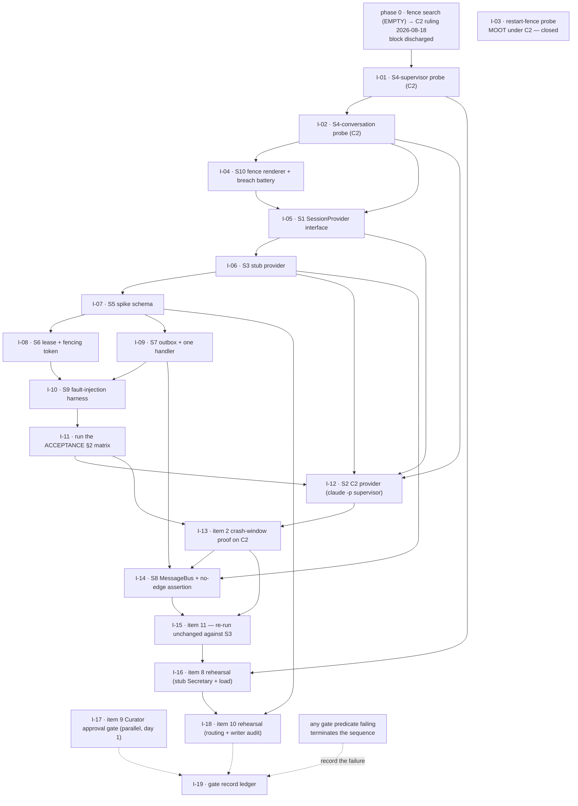

# Plan — the session-provider spike, decomposed into issues

**Status:** issued. The issues below exist as `#6`–`#24`; this file remains their definition of
record, and the desk applies changes made here to the issue bodies. No `gh` command is run from
here.
**Date:** 2026-08-18 (created); **revised 2026-08-18** for the C2 ruling — see the banner below.
**Task:** `interlock-spike-issue-decomposition-20260818`; revision `interlock-c2-issue-rewrite-20260818`
**Refs:** `#740`; `DECISIONS.md` D-0020…D-0026 and the 2026-08-18 enactment entry (D- number
pending); `docs/proposals/agent-view-gate-scaffold.md` §3 (scaffold inventory S1–S10, per-item
minimum scaffold, phase order 0–10); `ACCEPTANCE.md` §1, §2 and §4;
`investigation/u1-session-id-bg-experiment.md` (phase 0, answered **negative**);
`investigation/pre-spawn-fence-search.md` (F6, **came up empty**; U27 negative, U28 positive, U32).

---

## 0. The C2 ruling, and what it changed here

**Operator ruling, 2026-08-18.** The pre-spawn fence search triggered by D-0024 came up empty
(`investigation/pre-spawn-fence-search.md` §3.1–§3.2: twelve candidate handles, every one discarded
at spawn, undeduplicated, post-spawn, or out of scope under D-0025). The operator has settled it:

> **Gate item 2 fails on Agent View (C1). The `Q-0004` path is taken, and per D-0025 the spike's
> `SessionProvider` is C2 — Interlock-supervised `claude -p` subprocesses.**

Recorded in the 2026-08-18 enactment entry (D- number pending at the time of this revision; a reader
with `origin/main` newer than that should substitute the real number wherever this phrase appears).

Three consequences run through the whole file:

1. **The phase-0 block is discharged.** `sequence_precondition` in §6 is `resolved`; the whole set is
   dispatchable subject only to `depends_on`. See §6 for the order that is now live.
2. **The provider is C2, not C1.** §4's survival matrix stops being a contingency and becomes the
   change log: four issues **rewritten** (I-01, I-02, I-12, I-13), two **partial** (I-04, I-16), one
   **moot and closed** (I-03), twelve untouched.
3. **The provider supplies no exclusion, and the spike must stop expecting one.** U27 is negative
   (a ~2–3 s admission window at `--session-id` creation, inside which two processes were admitted,
   both exited 0, and **both wrote to one transcript**), U32 is negative (`--resume` excludes nothing
   at all, at any stagger), U28 is positive but only for *identity durability* across SIGKILL. The
   fence search's §5.3 conclusion is now a design premise of this plan: **Interlock's own fencing
   token, validated atomically as part of each protected write, is the only exclusion in the
   system.** Where that changes an acceptance criterion, it is written into the issue rather than
   left in the investigation note.

**What is *not* changed by the ruling.** The gate items, their predicates and `ACCEPTANCE.md` §1 are
untouched — item 2 failing on C1 is a failure of the provider, not a reclassification of the item
(F6). D-0020's phase order, D-0021's provisional marking, D-0022's two deferred items, D-0023's
part 2 obligation and D-0026's durability split all stand as written.

**`ACCEPTANCE.md` §4 still applies to C2.** Items 1, 2, 3, 7, 8 and 10 must be proven in full against
C2; no C1 evidence carries over. In practice C1 produced no gate evidence to carry — the sequence
never dispatched past phase 0 — so this is a statement about the future rather than a loss.

---

## 1. What this decomposes, and what it deliberately leaves out

D-0020 adopts **Strategy B+**: the minimum vertical slice S1–S9 (S10 carried from
`settings/generator.py`), with one rule from Strategy C — **S1 is written first, and S3 is
implemented before S2**. §3.5 of the proposal fixes the phase order 0–10 and gives each phase an
exit condition. This file turns phases **1a–10** into 19 issues, each sized to one worker dispatch — 18 of them live
since the 2026-08-18 C2 ruling closed I-03 as moot (§0, §4).

**Not issued here, and why:**

| Left out | Reason |
|---|---|
| **Phase 0** — the U1 `--session-id` / `--bg` experiment | Already done and recorded in `investigation/u1-session-id-bg-experiment.md`. Verdict: **negative**. |
| **The pre-spawn fence search** (Decision 6a's tail, F6) | Ran as `interlock-fence-search-20260818` and **reported empty** (`investigation/pre-spawn-fence-search.md`). It was phase 0's exit condition and it blocked dispatch of every issue but I-17 until it landed; the operator's 2026-08-18 ruling on it discharged the block and switched the provider to C2. `sequence_precondition` in §6 records the resolution and the date. |
| **Real proof of gate items 8 and 10** | D-0022 defers them by name to their own discharge points — item 8 *before the canary starts*, item 10 *at the canary*. The spike only **rehearses** them (I-16, I-18). The real proofs are later work and are not spike issues. |
| **The canary itself** (`ACCEPTANCE.md` §3) | Same clause. It needs v1 as a live counterparty and the implementation running. |

**Every issue below inherits D-0026.** The `SessionProvider` interface (S1) and the tests are the
**durable** output. Every implementation the spike produces — **including S5's schema** — is
throwaway by default and may be promoted only by a new `D-` entry. Each issue carries a `durable:`
field saying which side of that line it falls on, and the acceptance criteria of I-05 and I-07
require the provisional/spike marking to be *in the file itself*.

---

## 2. How to read the machine-readable block

§6 is a single fenced `yaml` block containing the whole issue set, under two top-level keys:
`sequence_precondition` (the phase-0 gate, now **resolved**) and `issues`. A tool that wants the
definitions should extract that one fence and parse it; the prose sections around it are commentary
and are not required to reconstruct any issue.

The issues now exist, so the `id` handles have real numbers behind them. Bodies keep the handles —
they are stable and self-consistent — and the desk expands them from the `github` field when it
posts:

| Handle | Issue | Handle | Issue | Handle | Issue | Handle | Issue |
|---|---|---|---|---|---|---|---|
| I-01 | `#6` | I-06 | `#11` | I-11 | `#16` | I-16 | `#21` |
| I-02 | `#7` | I-07 | `#12` | I-12 | `#17` | I-17 | `#22` |
| I-03 | `#8` | I-08 | `#13` | I-13 | `#18` | I-18 | `#23` |
| I-04 | `#9` | I-09 | `#14` | I-14 | `#19` | I-19 | `#24` |
| I-05 | `#10` | I-10 | `#15` | I-15 | `#20` | | |

Per-issue fields:

| Field | Meaning |
|---|---|
| `id` | Stable handle used by `depends_on` in this file. **Not** a GitHub number. |
| `github` | The real issue number, assigned at creation. Added in the 2026-08-18 C2 revision, once the set had been filed. |
| `title` | Issue title, verbatim, English. |
| `labels` | Proposed labels. See §5 for the label vocabulary — several do not exist in the repo yet and must be created first. |
| `size` | `S` = one focused worker dispatch. `M` = one dispatch, but a long one. Estimated **for an AI worker**, not for a human: mechanical breadth (many probe cases, many test rows) is cheap; genuinely novel design is not. These do not sum to D-0020's 12–16 engineer-day figure and are not meant to. |
| `phase` | The `docs/proposals/agent-view-gate-scaffold.md` §3.5 phase this issue belongs to. |
| `tier` | T1 / T2 / T3 per §3.1, or `-` where the issue is bookkeeping. |
| `gate_items` | `ACCEPTANCE.md` §1 item numbers this issue moves. `rehearses:` marks D-0022's two deferred items. |
| `scaffold` | S1–S10 components built or carried. |
| `depends_on` | Hard prerequisites, by `id`. |
| `completes_after` | I-19 only. Issues whose evidence the gate record gathers, which are **not** prerequisites for starting it — see I-19's Dependencies section for why that distinction matters. |
| `also_written_when` | I-19 only. A `{fails: [...], rule: ...}` mapping enumerating every issue whose failure terminates the sequence, on which branches the record is written **instead of**, not after, the success-branch evidence. |
| `c2` | `survives` / `partial` / `rewritten` / `moot`. `partial` means the deliverable stands but its provider-facing half is re-pointed at the new backend. Written as a contingency before the ruling; since 2026-08-18 it is the **change log** of what this revision actually did to each issue. See §4. |
| `c2_revision` | Present on every issue this revision touched — the seven re-pointed ones (I-01, I-02, I-03, I-04, I-12, I-13, I-16) plus I-08, I-14 and I-19, where the ruling changes what the issue must carry without changing its deliverable. Says what changed and, for `rewritten`, what the issue now probes. Absent means the body carries at most a corrected cross-reference (I-05, I-15, I-17); §4 lists those. |
| `durable` | A **list**, because most issues produce more than one kind of artifact. `contract` = a durable non-code artifact (S1; the gate record). `tests` = durable test material, which D-0014's rescue list and D-0026 both want kept. `throwaway` = an implementation. An issue that builds something *and* tests it carries **both** `tests` and `throwaway`, deliberately: D-0026 makes every implementation throwaway **by default**, including S5's schema, and the two halves must be promotable separately so that keeping the tests never drags the implementation along with them. |
| `body` | The issue body, verbatim, ready to post. |

---

## 3. Dependency order

**Phase 0 is closed.** U1 is negative, F6's fence search reported empty, and the operator's
2026-08-18 ruling took the `Q-0004` path to C2. Nothing is held behind a phase-0 block any more, so
the `P0` node is drawn as discharged and the only constraints left are `depends_on` edges.

**There is no terminal gate in the graph now.** I-03 was it — the probe for a handle mediating
*supervisor*-initiated restarts — and under C2 it is **moot** (D-0025: no other party can restart a
worker, so the fail-closed spawn precondition covers every start). It is closed, not rewritten, and
phase 2b (I-04) inherits its edge from phase 1b directly.

That does not make the sequence unconditional. Every issue carrying a gate predicate can still fail
its item and terminate the run — I-13 above all, which is now item 2's proof against C2 and is the
riskiest issue in the set for the same reason it was before. What changed is that the failure would
no longer route to `Q-0004`: `Q-0004` is resolved and spent. A C2 failure of item 2 is a failure with
**no designated third provider named by any current `D-` entry** — C3 (the Agent SDK) is recorded by
D-0025 as a genuine second choice, but adopting it would take a new decision. I-19 must say so if it
comes to that.



**Five things the graph is saying that are easy to miss.**

1. **I-17 has no edges in.** Item 9 has zero session-backend dependency (§3.1, and `ACCEPTANCE.md`
   §4 deliberately omits it from the re-run list). It starts immediately, in parallel with I-01, and
   is unaffected by the provider ruling — it was the one issue exempt from the phase-0 block and it
   is the one issue the ruling could not have touched.
2. **I-03's edge is gone, and I-04 did not lose anything with it.** D-0023 part 2 makes fail-closed
   *Interlock's own* obligation under D-0017 "regardless of provider". What I-04 loses is not scope
   but a precondition: item 3's discharge is no longer conditional on a probe that can come back
   empty. Its restart-preservation half is re-pointed at C2 restarts.
3. **The dotted edges into I-19 are not prerequisites.** The gate record is due whether the sequence
   discharges the gate or terminates at **any** issue carrying a gate predicate, so it must not be
   blocked behind evidence that a failure guarantees will never arrive. `also_written_when` in the
   YAML enumerates those branches — with I-03 removed from the list, since a closed issue cannot
   fail.
4. **The durable-core chain I-05 → I-07 → I-09 → I-11 does not test the provider**, and the ruling
   proved that the hard way: none of it needed rewriting. It is drawn under phase 2b to keep the
   §3.5 sequence honest, not because the provider swap invalidated it.
5. **I-01 and I-02 are still the front of the sequence, aimed at a different surface.** They are
   rewritten, not deleted: the questions the phase-1 probes exist to answer are the same questions,
   asked of `claude -p` subprocesses under Interlock's own supervision.

---

## 4. What the C2 switch actually cost — the survival matrix, settled

This table was written as a contingency before the fence search reported. The search came up empty,
the operator ruled, and the table is now the **record of what this revision changed**. Its
predictions held: the counts below are the ones the contingency named.

| Verdict | Issues | What this revision did |
|---|---|---|
| **`survives`** — no provider dependency at all | I-05 (S1), I-06 (S3), I-07 (S5), I-08 (S6), I-09 (S7), I-10 (S9), I-11 (§2 matrix), I-14 (S8), I-15 (item 11), I-17 (item 9), I-18 (item 10 rehearsal), I-19 (ledger) | Deliverables and criteria unchanged, with three kinds of exception, none of which changes what the issue builds: **stale cross-references** to the closed I-03 or to Agent View are corrected (I-05, I-15, I-17); **I-08** gains one criterion and a `c2_revision` note, because the ruling makes its token the only exclusion in the system; **I-14** gains a translation of item 6's UI-shaped wording, since under C2 there is no UI to attach; and **I-19** drops I-03 from `also_written_when` and gains four criteria about the provider history it must now carry. Everything else is byte-identical. |
| **`partial`** — stands, with its provider-facing half re-pointed | I-04 (S10); I-16 (item 8 rehearsal) | A `c2_revision` note and a small number of criteria changes. I-04: the renderer, the `PreToolUse` deny hook and the spawn precondition are Interlock's under D-0017 and are untouched; "restart preserves the fence" is re-observed against a **C2** restart, which is now Interlock's own respawn. I-16: the Secretary intake, the queue boundary and the latency comparison stand; the load driver was I-01's Agent View `--exec` generator and is replaced by a `-p` worker generator, and U6 is re-asked of C2. |
| **`rewritten`** — same question, new surface | I-01 (S4-supervisor), I-02 (S4-conversation), I-12 (S2 → the C2 provider), I-13 (item 2 proof) | Title, background, scope and acceptance criteria rewritten against `claude -p` under Interlock's own supervision. The questions survive; the harnesses do not. |
| **`moot`** | I-03 | **Closed**, not rewritten. Under C2 no other party can restart a worker (D-0025), so the supervisor-restart hole D-0023 part 3 opens does not exist and the terminal probe has nothing to probe. Its two non-restart sub-questions did not vanish and are re-homed — see the note below. |

**12 of 19 issues came through untouched, and two more (I-04, I-16) kept everything but their
provider-facing half.** That is the concrete content of D-0019's promise that a gate failure replaces
only the `SessionProvider`, and it is the first time the promise has been tested rather than
asserted. I-15 remains the *measurement* of it.

**I-03 is closed, but two of its three questions are not.** Closing an issue must not silently drop
scope, so both are re-homed by name:

- **The public effective-configuration readback (Decision 4a′, U3).** Still unanswered, still decides
  whether D-0023's weakening of item 3 is needed at all. Moved into **I-01**, whose C2 sweep is now
  the place a readback would be found.
- **`PreToolUse` ordering under `bypassPermissions` (U15).** Interlock renders per-role settings for
  a `-p` subprocess it owns, so this question got *more* relevant, not less. Moved into **I-04**,
  which is where the deny hook is installed.

Only the supervisor-restart probe itself is dropped, and only because C2 removes the hole it probes.

Two cautions on reading this table:

- **`ACCEPTANCE.md` §4 requires items 1, 2, 3, 7, 8 and 10 to be proven in full against the new
  provider.** "Survives" means *the issue's deliverable* survives, not that gate evidence carries
  over. In this instance nothing had to carry: the sequence never dispatched past phase 0 under C1,
  so no C1 gate evidence exists. I-16 and I-18's rehearsals run once, against C2.
- **`survives` is not the same as `unaffected by the fence-search findings`.** I-08 in particular
  survives untouched *as a deliverable* while its importance goes up sharply: §5.3 of the fence
  search makes its fencing token the only exclusion in the system under C2. Its `c2` verdict stays
  `survives`; its `c2_revision` note says why it now carries more weight than the label suggests.

---

## 5. Label vocabulary

Proposed, and mostly new — the repo has no issue labels for this work yet. The desk should create
the set before filing, or strip the `labels` field and file untagged.

**Changed by the C2 ruling.** `spike/agent-view` keeps its name because it names the D-0020 spike's
*lineage*, not its provider, and renaming a label across nineteen filed issues buys nothing; its
meaning is restated below. `agent-view-specific` is replaced by `provider/c2` on the four rewritten
issues. `blocked/fence-search` is **retired** — the search reported — and `terminal-gate` now marks
nothing, since its only bearer (I-03) is closed. Both are kept in the table with their retirement
stated, so a reader meeting them on an old issue can tell what happened.

| Label | Meaning |
|---|---|
| `spike/agent-view` | Belongs to the D-0020 Strategy B+ spike. On every issue here. The name is historical: since the 2026-08-18 ruling the spike's provider is C2, not Agent View. |
| `phase/1a` … `phase/10` | §3.5 phase. |
| `tier/T1`, `tier/T2`, `tier/T3` | §3.1 classification. |
| `gate-item/1` … `gate-item/11` | `ACCEPTANCE.md` §1 item the issue moves. |
| `scaffold/S1` … `scaffold/S10` | §3.2 component. |
| `size/S`, `size/M` | One worker dispatch; `M` is the long kind. |
| `durable/contract`, `durable/tests`, `durable/throwaway` | D-0026 lifetime. |
| `survives/c2`, `partial/c2`, `provider/c2` | §4 split. `partial/c2` is the issue that stands with its provider-facing half re-pointed (I-04, I-16). `provider/c2` replaces the old `agent-view-specific` on the four rewritten issues (I-01, I-02, I-12, I-13) and means the issue is written against `claude -p` and would be rewritten again by another provider switch. |
| `agent-view-specific` | **Retired 2026-08-18.** Superseded by `provider/c2`. Strip it wherever it is still applied. |
| `terminal-gate` | **Retired 2026-08-18.** Its only bearer was I-03, now closed as moot; no issue in the set routes to `Q-0004` any more, because `Q-0004` is resolved. |
| `blocked/fence-search` | **Retired 2026-08-18.** Held I-12 and I-13 pending `interlock-fence-search-20260818`; the search reported and the block is discharged. |
| `parallel/day-1` | No prerequisites; start immediately. Only I-17. |

---

## 6. Issue definitions

```yaml
# Session-provider spike (D-0020 Strategy B+) — issue definitions.
# `id` is a handle local to this file; `github` carries the real issue number.
# Phase 0 is complete: U1 negative (investigation/u1-session-id-bg-experiment.md), F6's fence
# search empty (investigation/pre-spawn-fence-search.md), and the operator ruled on 2026-08-18.
# The provider is C2 — Interlock-supervised `claude -p` subprocesses (D-0025 part 2).
sequence_precondition:
  id: P0-fence-search
  source: "docs/proposals/agent-view-gate-scaffold.md §3.5 phase 0; DECISIONS.md D-0024, D-0025"
  state: resolved
  resolved_on: "2026-08-18"
  ran_as: interlock-fence-search-20260818
  report: investigation/pre-spawn-fence-search.md
  outcome: |
    The search came up EMPTY. On CLI 2.1.234 no public --bg surface lets a caller commit a session
    identity or acquire an exclusive claim before the spawn; twelve candidate handles were examined
    (§3.1-3.2 of the report) and every one is discarded at spawn, documented as not deduplicated,
    a post-spawn artifact, or out of scope under D-0025's local-execution pre-filter. The two best
    candidates were refuted by experiment: `--bg --resume <uuid>` silently forks the conversation
    into a NEW CLI-assigned identity (exit 0, no warning), and a duplicate `--name` is accepted for
    two live background sessions.
  ruling: |
    Per D-0024's tail the operator has settled it: gate item 2 FAILS on Agent View (C1), the
    Q-0004 path is taken, and the spike's SessionProvider is C2 — Interlock-supervised `claude -p`
    subprocesses (D-0025 part 2). Recorded in the 2026-08-18 enactment entry (D- number pending).
    This is a failure of the provider, not a reclassification of item 2 (F6).
  dispatch_state: |
    The block is discharged. Every issue below is dispatchable subject only to `depends_on`.
    I-03 is closed as moot rather than dispatched. I-12 and I-13 are no longer held: their
    `blocked/fence-search` label is retired and they are rewritten against C2.
  carried_findings: |
    Three findings from the report are now premises of the issues below rather than background
    reading, and each is written into the acceptance criteria of the issue it constrains:
      - U27 NEGATIVE: `-p --session-id` refusal is NOT atomic. A ~2-3 s admission window was
        measured on one machine (do not treat the figure as a constant — U34); in 5 of 5
        simultaneous trials both processes were admitted, both exited 0, both reported the same
        session_id, and BOTH WROTE to one transcript. A demonstrated single-writer violation at
        the provider's own identity level. → I-13, I-12.
      - U32 NEGATIVE: `--resume` carries no exclusion at all — two concurrent resumes of one
        session admitted, simultaneously and at a 5 s stagger, outside U27's window. This is the
        path C2 uses after a crash. → I-13, I-12, I-08.
      - U28 POSITIVE (both halves): after SIGKILL of the holder the claim held through every probe
        taken (t+2 s, t+65 s, after a resume, ~25 min) and `--resume` returned the same session_id.
        Identity is durable across an ungraceful kill; expiry at a longer horizon is untested
        (U36). → I-02, I-13.
    Net: C2 gives durable identity and no usable exclusion primitive. Per the report's §5.3 the
    single-writer half of O6 comes from Interlock's own fencing token, validated atomically as
    part of each protected write (ACCEPTANCE.md §2) — under C2 that token is the ONLY exclusion
    in the system.
  no_third_provider: |
    Q-0004 is resolved and spent. If item 2 fails again on C2, no current D- entry designates a
    third provider: D-0025 records C3 (the Claude Agent SDK) as a genuine second choice, but
    adopting it requires a new decision. I-19 records that plainly if the branch is taken.

issues:

  - id: I-01
    github: 6
    title: "S4-supervisor: probe the `claude -p` subprocess surface Interlock will own"
    labels: [spike/agent-view, phase/1a, tier/T1, gate-item/1, gate-item/3, gate-item/8, scaffold/S4, size/M, durable/throwaway, provider/c2]
    size: M
    phase: "1a"
    tier: T1
    gate_items: [1, 3, 8]
    scaffold: [S4]
    depends_on: []
    c2: rewritten
    c2_revision: |
      REWRITTEN for C2 (ruling 2026-08-18). Was "S4-jobs: probe the Agent View supervisor surface
      with `--exec` jobs". The split into a supervisor half and a conversation half survives, but
      its *reason* changes: under C1 the split existed because `--exec` jobs cost no model quota,
      and under C2 there is no free surface — every `claude -p` run takes model turns. The split is
      now by subject matter: this half owns everything Interlock's own process supervision touches,
      and I-02 owns everything that needs a conversation. U2/U4/U6 are replaced by their C2
      analogues (see the body), and the effective-configuration readback probe is inherited from
      the closed I-03.
    durable: [throwaway]
    body: |
      ## Background

      Phase 1a of the spike (`docs/proposals/agent-view-gate-scaffold.md` §3.5), rewritten for the
      2026-08-18 ruling: the pre-spawn fence search came up empty, gate item 2 failed on Agent View,
      and per D-0025 the provider is **C2 — Interlock-supervised `claude -p` subprocesses**. Under
      C2 there is no daemon, no roster, and no supervisor but our own: **Interlock's process
      supervision *is* the session lifecycle**. That is C2's advantage on O8 and O11, and it is also
      its cost — the incumbent supplied this machinery for free, and we are about to write it.

      This issue is the **supervisor half** of S4: everything a parent process must know about a
      `claude -p` child before Interlock can be trusted to own one. The **conversation half** (I-02)
      covers resume and the worktree lifecycle, which need real multi-turn sessions.

      The shape of the split has changed. Under C1 it existed because `--exec` jobs were free; C2 has
      no free surface, so keep prompts trivial ("reply with ok") and say what was spent.

      ## Scope

      In scope — a throwaway harness that, using **only documented flags** (D-0010):

      - **Spawn.** Start `claude -p` as a child process this harness owns outright: argv, `cwd`,
        environment, `--settings`, `--permission-mode`, `--output-format json` and `stream-json`.
        Record what a parent must supply for a spawn to be reproducible.
      - **Streams.** Characterise `stdout` and `stderr` separately: whether structured output is
        parseable as it arrives or only at exit, whether `stream-json` framing is line-delimited and
        stable, whether partial output is flushed on abnormal termination, and what appears on
        `stderr` that appears nowhere in the structured output. The fence search found the refusal
        message on `stderr` with an **empty** `stdout` (§4.2), so a supervisor that reads only
        `stdout` sees nothing at all in the one case it most needs to see.
      - **Exit codes.** Enumerate them against causes: success, the `already in use` refusal
        (observed exit 1), an unusable flag, a model/API failure, an interrupted run. State plainly
        which causes are distinguishable by exit code alone and which are not.
      - **Signals and process topology.** SIGTERM, SIGINT and SIGKILL to the child; what the child
        leaves behind (MCP servers, hook commands, subprocesses of its own); whether a process group
        or session is needed to reap it; and — the C2 analogue of U4's ungraceful daemon kill —
        **what happens to running `-p` children when the supervisor itself is SIGKILLed**. Orphaned
        workers that keep running and keep writing are the C2 shape of that hazard.
      - **The admission window, characterised as a supervisor parameter.** U27 measured a ~2–3 s
        window at `--session-id` creation on one machine. Re-measure it, sweep the stagger, and probe
        **what bounds it** (U34: transcript-file creation, first API response, or something else)
        and **what the refusal is keyed to** (U36: persisted transcript, lock file, or live process
        — the evidence is mixed, and it decides whether the claim can be cleared or spoofed by
        on-disk state). This is the input a retry-delay design needs. It is **not** a fence: I-13
        owns the item-2 predicate, and this issue must not pre-empt its verdict.
      - **Concurrency and readout latency.** Run N concurrent `-p` workers at the intended cap and
        record how long Interlock takes to obtain each worker's state. Under C1 this asked whether a
        daemon serialised status queries (U6); under C2 there is no daemon, so the question moves to
        our side of the line: whether **obtaining state from N children is itself a blocking
        operation** in the supervisor. This is gate item 8's provider-side input, and I-16 folds it
        in.
      - **Capability/version probe** (`capabilities`, else `--version`), raw output recorded, per
        D-0010.
      - **Effective-configuration readback** (inherited from the closed I-03; Decision 4a′, U3).
        Probe whether any **public** surface reports the permission / sandbox / hook configuration a
        running worker actually loaded. If one exists, item 3's equality check becomes runnable as
        written and I-04's breach battery can be reduced to a complement.

      Out of scope — anything needing a conversation (that is I-02); any Interlock control-plane
      code; any durable storage; the item-2 proof (I-13).

      ## Acceptance criteria

      - [ ] Spawn / structured-state read / signal-terminate / reap all complete with documented
            flags only, with argv, output and exit codes recorded verbatim.
      - [ ] **The internals-free negative is proven**: the harness behaves identically with the CLI's
            per-user config directory, transcript paths and any internal socket made unreadable or
            absent. A harness that merely *does not currently* read them does not satisfy this — the
            negative must be executed. Note the environmental trap the fence search hit (§2 of
            `investigation/pre-spawn-fence-search.md`): under a sandbox a `-p` run succeeds and
            returns a `session_id` while **no transcript is ever written**, which can silently turn a
            refusal probe into a false negative. State which commands ran sandboxed.
      - [ ] Stream framing, flush-on-abnormal-exit, and the `stderr`-only content are recorded, with
            a verbatim example of each.
      - [ ] The exit-code table is complete for the causes above, and it states which distinct causes
            share a code. **Exit 0 is recorded as evidence of nothing** — U1 §5.2 and the fence
            search's A1/A4 both show exit 0 accompanying a silently wrong outcome.
      - [ ] The supervisor-kill case is answered either way: after SIGKILL of the parent, whether
            `-p` children survive, keep writing, and what reclaims them.
      - [ ] The admission window is re-measured with the sweep recorded, and U34 and U36 are answered
            **or explicitly left open with what was tried**. The measured width is recorded as a
            one-machine, one-load figure and **not** as a provider constant.
      - [ ] Baseline and under-load state-readout latency are recorded as numbers with the worker
            count.
      - [ ] The effective-configuration readback question is answered either way — it decides whether
            D-0023's weakening of item 3 is needed at all.
      - [ ] The exact CLI version and the full capability-probe output are recorded (D-0010).
      - [ ] Model quota spent is recorded, and every child started is terminated and reaped.
      - [ ] Findings land in `investigation/` in the style of `u1-session-id-bg-experiment.md` and
            `pre-spawn-fence-search.md`: transcript verbatim, verdict separated from proposal, new
            unknowns proposed as Appendix A rows (numbering continues past U37 — the report proposes,
            it does not assign), no `D-` entry created.

      ## Gate mapping

      Supplies the provider-side inputs for **items 1, 3 and 8**. Discharges none of them on its own:
      item 1 also needs I-02's resume evidence, item 3 needs I-04, item 8 needs I-16.

      ## Exit condition (§3.5 phase 1a)

      The supervisor verbs work through documented flags, and the analogues of U2 / U4 / U6 named
      above are answered. A phase that fails its exit condition is **a report to a human, not a
      reason to proceed**.

      ## Dependencies

      None. Phase 0 is closed: U1 negative, the fence search empty, the provider ruled to be C2
      (`investigation/pre-spawn-fence-search.md`; the 2026-08-18 enactment entry, D- number pending).

      ## Notes

      Throwaway by construction (D-0026). This issue has been rewritten once already, from the Agent
      View `--exec` surface; the questions survived that rewrite and would survive another.
  - id: I-02
    github: 7
    title: "S4-conversation: probe multi-turn resume and working-tree ownership on real `claude -p` workers"
    labels: [spike/agent-view, phase/1b, tier/T1, gate-item/1, gate-item/7, scaffold/S4, size/M, durable/throwaway, provider/c2]
    size: M
    phase: "1b"
    tier: T1
    gate_items: [1, 7]
    scaffold: [S4]
    depends_on: [I-01]
    c2: rewritten
    c2_revision: |
      REWRITTEN for C2 (ruling 2026-08-18). Was "S4-sessions: probe conversation resume and the
      worktree lifecycle on real `--bg` sessions". Both halves change surface. Resume moves from
      `claude respawn` on the Agent View roster to `claude -p --resume <uuid>` — a path the fence
      search already probed from two directions (U28 positive for identity durability, U32 negative
      for exclusion), so this issue starts from evidence rather than from the documentation. Item 7
      changes character entirely: under C2 nobody but Interlock owns the working tree (D-0025's O8
      argument), so the question is no longer "can the provider reclaim a worktree behind our back"
      but "**does the `-p` child create or move into a working tree of its own**" — which A6 of the
      fence search observed a `--bg` session doing, unasked, about nine seconds in.
    durable: [throwaway]
    body: |
      ## Background

      Phase 1b, rewritten for the C2 ruling. The same harness as I-01, driven by a small number of
      **real multi-turn `claude -p` workers**. I-01 cannot stand in for this: a single `-p`
      invocation with a trivial prompt exercises the process surface but has no conversation to
      resume and no reason to touch a working tree.

      Under C2 a "session" is not a thing the provider hosts — it is a **session id plus a
      transcript**, and Interlock re-enters it by spawning a fresh `-p` process with `--resume`.
      Item 1's resume verb therefore has to be demonstrated as *continuity across invocations*, not
      as a running process being reattached to.

      Two findings from `investigation/pre-spawn-fence-search.md` are the starting point, not the
      conclusion:

      - **U28 (positive).** After SIGKILL of the holder, the identity survived — `--resume` returned
        the same `session_id` with exit 0, and a fresh `--session-id` claimant stayed refused at
        t+2 s, t+65 s, after a resume, and about 25 minutes later. Expiry at a longer horizon, or
        under a cleanup sweep, was **not** tested (U36).
      - **U32 (negative).** `--resume` excludes nothing: two concurrent resumes of one session were
        both admitted, simultaneously and at a 5 s stagger, both exit 0, both carrying the same
        `session_id`. The documentation says as much for the interactive case — *"If you resume the
        same session in two terminals without forking, messages from both interleave into one
        transcript."*

      So resume works and resume is unguarded. This issue establishes what that means for a
      supervisor; **I-13 owns the single-writer verdict** and this issue must not pre-empt it.

      ## Scope

      In scope:

      - **The full item 1 cycle on one real top-level worker**: start → obtain structured state →
        stop → resume, driven only through documented flags, on a worker that holds a genuine
        multi-turn conversation.
      - **Conversation continuity across invocations.** A codeword-style probe of the kind A4 used
        (§3.3.1 of the fence search): establish content in turn 1, resume in a *new process*, and
        show the content is present. Repeat across several resumes so the transcript grows rather
        than forks. Record whether the transcript stays one file under one `session_id`, or whether
        anything fork-like happens — under `--bg` the CLI silently behaved as `--fork-session`
        (U33), and the same must be checked, not assumed, on `-p`.
      - **Resume across a supervisor restart.** Kill the supervisor (not the child), restart it, and
        resume from persisted state only. This is the C2 shape of the lifecycle question and it is
        the path a crash actually takes.
      - **Working-tree ownership (item 7).** A git fixture carrying **uncommitted**, **untracked**
        and **unpushed** changes, driven through every lifecycle transition Interlock performs —
        spawn, stop, resume, worker exit, cleanup. Observe whether the `-p` child ever creates a
        worktree of its own, moves its `cwd`, or removes anything: A6 of the fence search watched a
        session move into `.claude/worktrees/probe` unasked, so the negative has to be executed
        rather than argued from "we did not pass `--worktree`".
      - **What a worker leaves behind.** `-p` runs hold no roster row and no process but do leave
        transcripts on disk (§6 of the fence search). Record what accumulates per worker and what
        Interlock must clean up, since under C2 nothing else will.

      Out of scope — the supervisor mechanics (I-01), the item-2 crash-window proof (I-13), and any
      Interlock control-plane code.

      ## Acceptance criteria

      - [ ] **The whole of item 1 is driven on one real top-level worker**: start → structured-state
            read → stop → resume, documented flags only. I-01's single-shot `-p` runs do not cover
            this — they have no conversation, so they cannot exercise the cycle item 1 names. Do not
            treat I-01's pass as covering it.
      - [ ] The structured state read here is machine-parseable from published output, not scraped
            from rendered screen text.
      - [ ] **The internals-free negative is re-run on this half too**: with the CLI's per-user
            config directory, transcript paths and any internal socket made unreadable, the
            conversation-driven cycle behaves identically. I-01's negative covers the single-shot
            path only.
      - [ ] Resume preserves **both** the conversation and the `session_id`, demonstrated across at
            least three successive resumes in fresh processes, with the transcript shown to grow in
            place. Any fork-like behaviour is recorded as a finding of the same class as U33.
      - [ ] Resume works after the **supervisor** is killed and restarted, from persisted state only.
      - [ ] For every transition × every fixture state: working-tree content is **byte-identical**
            afterwards, **or** the transition is refused while unsaved work exists. Byte-identical
            means a recorded hash comparison, not an eyeballed `git status`. The untracked case is
            included explicitly.
      - [ ] **The child creates no working tree of its own**, or, if it does, the conditions are
            recorded exactly and the finding is flagged: under C2 the whole O8 argument for this
            provider is that nobody but Interlock owns the working tree, and a `-p` child that
            relocates itself weakens it. `ACCEPTANCE.md` §1 item 7's tail applies unchanged — *if the
            provider can reclaim a worktree without an interlock the control plane can observe or
            veto, that is a gate failure, not a workaround*.
      - [ ] What each worker leaves on disk is enumerated, with the cleanup Interlock must perform
            stated.
      - [ ] Worker count and model quota consumed are recorded, and every process started is
            terminated and reaped.
      - [ ] Findings land in `investigation/`.

      ## Gate mapping

      **Discharges item 1** — this half carries the full cycle on a real worker; I-01 supplies the
      supervisor-side evidence around it. **Discharges item 7** on its own, subject to the §3.5 exit
      condition.

      ## Dependencies

      I-01 (the harness this extends).

      ## Notes

      Costs real subscription quota — keep the worker count small and say what it was. Throwaway
      under D-0026.
  - id: I-03
    github: 8
    title: "Probe the supervisor-initiated restart fence (terminal gate for item 3)"
    state: closed
    close_reason: moot-under-c2
    labels: [spike/agent-view, phase/2a, tier/T1, gate-item/3, scaffold/S4, size/S, durable/throwaway]
    labels_removed: [agent-view-specific, terminal-gate]
    size: S
    phase: "2a"
    tier: T1
    gate_items: [3]
    scaffold: [S4]
    depends_on: [I-01, I-02]
    c2: moot
    c2_revision: |
      MOOT under C2 (ruling 2026-08-18) — **close this issue**, do not rewrite it. The hole it was
      written to probe is that the provider's own supervisor can restart a worker with no Interlock
      spawn call at all (V8). Under C2 there is no other supervisor: Interlock owns the child
      process outright, so every start goes through Interlock's own fail-closed spawn precondition
      (D-0025's third consequence, in its own words). A probe for a handle mediating someone else's
      restart has nothing left to probe.
      Closing it removes the sequence's only terminal gate. It does **not** remove the sequence's
      ability to fail: I-04 can still fail item 3, and I-13 can still fail item 2.
      Two of its three sub-questions are NOT moot and are re-homed rather than dropped:
        - the public effective-configuration readback (Decision 4a′, U3) → I-01;
        - `PreToolUse` ordering under `bypassPermissions` (U15) → I-04, which is where the deny hook
          is installed, and where it matters more under C2 because Interlock renders the settings
          it passes to a child it owns.
      Only the supervisor-restart probe itself is dropped.
    durable: [throwaway]
    body: |
      ## Closed — moot under C2

      This issue probed for a handle mediating **supervisor-initiated** restarts: the case where the
      provider's own supervisor restarts a worker with no Interlock spawn call at all (V8), leaving
      the per-role fence unverified on a path Interlock never sees. It was the sequence's single
      terminal exit condition (D-0023 part 3, §3.5 phase 2a).

      The 2026-08-18 ruling closes it. The pre-spawn fence search came up empty, gate item 2 failed
      on Agent View, and per D-0025 the provider is **C2 — Interlock-supervised `claude -p`
      subprocesses**. D-0025 states the consequence directly: C2 removes this hole entirely, because
      under C2 no other party can restart a worker, so the fail-closed spawn precondition covers
      every start. There is no second supervisor to race.

      **The scope does not vanish with the issue.** Two of the three questions this issue carried are
      unaffected by the provider switch and have been moved:

      - **Public effective-configuration readback** (Decision 4a′, U3) — moved to **I-01**. It still
        decides whether D-0023's weakening of item 3 is needed at all, and if a readback exists,
        item 3's equality check becomes runnable as written and I-04's breach battery becomes a
        complement rather than a substitute.
      - **`PreToolUse` ordering under `bypassPermissions`** (U15) — moved to **I-04**, where the deny
        hook is installed. Under C2 this matters *more*, not less: Interlock renders the per-role
        settings it hands to a child it owns, so the ordering is now part of our own fence.

      Only the supervisor-restart probe itself is dropped, and only because C2 removes what it
      probed. Nothing here is a reclassification of item 3 — its predicate is unchanged, and I-04
      still has to discharge it.

      Refs: `investigation/pre-spawn-fence-search.md`; D-0023, D-0025; the 2026-08-18 enactment entry
      (D- number pending).
  - id: I-04
    github: 9
    title: "S10: carry the per-role fencing renderer, add the `PreToolUse` deny hook and the breach-probe battery"
    labels: [spike/agent-view, phase/2b, tier/T1, gate-item/3, scaffold/S10, size/M, durable/tests, durable/throwaway, partial/c2]
    size: M
    phase: "2b"
    tier: T1
    gate_items: [3]
    scaffold: [S10]
    depends_on: [I-02]
    c2: partial
    c2_revision: |
      PARTIAL under C2 (ruling 2026-08-18). Three changes, no change of deliverable.
        1. `depends_on` moves from I-03 to I-02. I-03 is closed as moot, so phase 2b now follows
           phase 1b directly, and item 3's discharge is no longer conditional on a probe that could
           come back empty.
        2. The restart-preservation assertion is re-pointed: the restart to observe is **Interlock's
           own respawn of a `-p` child**, which under C2 is the only restart there is.
        3. U15 (`PreToolUse` ordering under `bypassPermissions`) is inherited from the closed I-03,
           and the fence search's A6/U35 finding is added as an acceptance criterion — a hook that
           exits non-zero was observed being **absorbed** by the CLI, which is exactly the fail-open
           shape this issue exists to rule out.
      D-0023 part 2 is why the rest stands untouched: fail-closed is Interlock's own obligation
      under D-0017 "regardless of provider".
    durable: [tests, throwaway]
    body: |
      ## Background

      Phase 2b. D-0023 settles item 3 in three parts, and this issue builds parts 1 and 2: the
      **observable** (a behavioural breach-probe battery, since there is no public readback of
      effective configuration — U3) and **Interlock's own fail-closed obligation**.

      D-0023 is emphatic that the breach battery is *a deliberate weakening of item 3, accepted by a
      human, not an equivalent method*. The residual must be stated in the gate record, not hidden:
      diffing Interlock's rendered inputs proves what we wrote, not what the provider loaded.

      **Under C2 this issue gains weight rather than losing it.** Interlock spawns the worker as a
      child process it owns, so the per-role settings that child runs under are ones *we* render and
      pass. There is no second supervisor to restart it behind our back — that is why I-03 is closed
      — but by the same token there is nobody else to blame when the fence is wrong.

      ## Scope

      - Carry the per-role fencing renderer from `settings/generator.py`, **minus the discarded
        transport and pattern axes** (R5).
      - Install a `PreToolUse` deny hook in session, and answer **U15** — `PreToolUse` ordering under
        `bypassPermissions` — which arrives here from the closed I-03.
      - Build the **breach-probe battery**: one forbidden operation **per rule in the role's fence**,
        not one per role. This distinction is the whole point — per-role probing leaves most rules
        unobserved.
      - Implement **Interlock's own spawn precondition**: validate the rendered per-role
        configuration and **refuse to spawn** on a broken one, recording the refusal.
      - Diff Interlock's own rendered inputs across restart.

      ## Acceptance criteria

      - [ ] **An Interlock-initiated restart preserves the fence**, shown by the breach battery
            denying every rule after restart as it did before. Under C2 the restart in question is
            Interlock respawning a `-p` child from persisted state — there is no other kind.
      - [ ] Every rule in every role's fence has a probe, and each probe is **denied**. Coverage is
            asserted mechanically against the rendered fence — a hand-maintained probe list that
            silently drifts from the fence is a failure of this criterion.
      - [ ] A deliberately broken configuration (config deleted, hook path unresolvable, sandbox
            profile absent) causes a **refused** spawn — never a downgraded one — and the refusal is
            recorded durably.
      - [ ] **The deny hook is proven to deny, not merely to run.** A6 of
            `investigation/pre-spawn-fence-search.md` (U35) observed a hook that exited **1** being
            absorbed: the CLI fell back to its default logic and the session completed normally. A
            hook whose non-zero exit is swallowed is not a fence. Assert the *effect* — the forbidden
            operation did not happen — and never the hook's own exit code.
      - [ ] Fail-open is tested for explicitly. F2/V15/V16 record this codebase's habit of
            ignore-and-continue under bad input, and `investigation/u1-session-id-bg-experiment.md`
            §5.2 shows the same shape on the CLI: **exit 0 is not evidence of anything**.
      - [ ] **U15 is answered** — `PreToolUse` ordering under `bypassPermissions` — and the answer is
            reflected in how the fence is rendered.
      - [ ] The gate record entry states the residual weakening in D-0023's own terms.

      ## Gate mapping

      **Discharges item 3.** Under C1 this discharge was conditional on I-03 having found a handle
      for the supervisor-restart path; under C2 that path does not exist, so the battery plus the
      fail-closed spawn precondition is the whole of it. The residual weakening D-0023 names is
      unchanged and still belongs in the gate record.

      ## Dependencies

      I-02 (phase 1b). If I-01's sweep found a public effective-configuration readback, run item 3's
      equality check as written and treat the battery as complementary rather than substitutive.

      ## Notes

      **Partially survives the C2 switch** — and the surviving part is the larger one. D-0023 part 2
      states the fail-closed obligation is Interlock's under D-0017 "regardless of provider, so this
      work is not wasted under any `Q-0004` outcome". Only the restart-preservation assertion was
      re-pointed at the new provider.
  - id: I-05
    github: 10
    title: "S1: write the provisional `SessionProvider` interface"
    labels: [spike/agent-view, phase/3, tier/T2, gate-item/11, scaffold/S1, size/M, durable/contract, survives/c2]
    size: M
    phase: "3"
    tier: T2
    gate_items: [11]
    scaffold: [S1]
    depends_on: [I-02, I-04]
    c2: survives
    durable: [contract]
    body: |
      ## Background

      Phase 3, and the **first durable artifact of the spike** (D-0026). Strategy B+ exists because
      of this ordering: S1 is written first, so no Agent-View-shaped assumption enters the contract,
      but *after* the T1 probes, because "S1 designed before any provider exists is a contract
      designed from imagination" (D-0020).

      D-0021 fixes what S1 is: **spike scaffold, not a settled contract**, marked provisional **in
      the file itself**, promoted only by a later `D-` entry. Until it exists, item 11 has nothing to
      substitute against (§2 of the proposal).

      ## Scope

      S1 carries:

      - the five D-0009 verbs (start, list, obtain structured state of, stop, resume);
      - a **provider-neutral lifecycle/availability readout** — the backend's own states plus an
        explicit **"could not observe"** case;
      - a typed error/unavailable result that is **never an empty one** (R4);
      - a **capability/version probe with a fail-closed spawn precondition** (D-0010).

      Two prohibitions, both load-bearing:

      - **S1 must not map its states onto D-0005's fact-state set.** Those six values are watcher
        facts whose predicates and precedence `Q-0012` leaves open; folding a provider's
        `blocked`/`done`/`failed` into them inside a provisional interface would either lose
        information or answer `Q-0012` by implementation. Conversion belongs to the detector layer.
      - **S1 must not carry a message-delivery verb.** Delivery stays with `MessageBus` per D-0009
        and is built as S8. What S1 records for it is the **absence** of the verb — that absence is
        the property gate items 6 and 11 exist to check.

      Also in scope: a written record of where each of the three previously-unassigned capabilities
      landed — message delivery to a worker (→ `MessageBus`/S8), reading back effective permission /
      sandbox / hook configuration (→ per I-01's readback finding, inherited from the closed I-03; where
        it belongs to neither contract, that
      must be **written down as such**), and observing or vetoing a workspace lifecycle transition
      (→ S1, being genuinely the provider's).

      ## Acceptance criteria

      - [ ] The file states, in itself, that it is provisional and that promotion requires a `D-`
            entry (D-0021).
      - [ ] Five verbs, the neutral readout with its "could not observe" case, the typed
            error/unavailable result, and the capability probe are all present with docstrings.
      - [ ] No fact-state vocabulary appears anywhere in S1 — assert this mechanically if practical.
      - [ ] No delivery verb, and the absence is documented as deliberate with its reason.
      - [ ] Each of the three capabilities above has a **named owner** written down, including the
            "belongs to neither contract" case where that is the answer.
      - [ ] The typed result can never be constructed as an empty success (R4).

      ## Gate mapping

      Unblocks **item 11**, which §3.3 records as "blocked on S1 existing at all".

      ## Dependencies

      I-02 (the provider evidence that teaches the contract) and I-04 — that is, all of phase 2b.
      §3.5 places phase 3 after phase 2b and D-0020 adopts that order as fixed. Phase 2a's terminal
      gate (I-03) is closed as moot under C2, so phase 2b no longer carries it.

      **Operator note:** S1 is provider-neutral by construction and `survives/c2`. If schedule
      pressure argues for starting it before phase 2b completes, that is defensible — but it means
      writing the contract with one provider's evidence and no item-3 verdict, which is the risk
      D-0020 named, and it is a deviation from the adopted order rather than a reading of it. The
      provider switch strengthens the case for provider-neutrality rather than weakening it: S1 came
      through the C2 ruling untouched, and that was the whole point of writing it this way.

      ## Notes

      **Durable output** under D-0026, together with the tests. This is the artifact the whole
      strategy is built to produce.

  - id: I-06
    github: 11
    title: "S3: implement the stub `SessionProvider` over local child processes"
    labels: [spike/agent-view, phase/3, tier/T2, gate-item/11, scaffold/S3, size/S, durable/throwaway, survives/c2]
    size: S
    phase: "3"
    tier: T2
    gate_items: [11]
    scaffold: [S3]
    depends_on: [I-05]
    c2: survives
    durable: [throwaway]
    body: |
      ## Background

      Phase 3. **S3 before S2** is the one rule Strategy B+ takes from Strategy C (D-0020). The
      reason is structural, not stylistic: writing the stub first means no Agent-View-shaped
      assumption ever enters the control-plane suite, so item 11 measures a structural property
      rather than a retrofit. It costs roughly 1–2 days over plain B, and **item 11 mandates S3
      regardless**.

      ## Scope

      A deliberately trivial S1 implementation over **local child processes, with no Claude in the
      loop**. ~150 LOC. Gate item 11 names this artifact by example ("a local process-based stub").

      ## Acceptance criteria

      - [ ] Implements every S1 verb, including the capability probe and the "could not observe"
            readout case — the degraded paths are the ones item 11's re-run will exercise.
      - [ ] Runs with no Claude CLI installed and no network.
      - [ ] Passes an (initially empty) control-plane suite, per the §3.5 phase 3 exit condition.
      - [ ] Deliberately trivial: no cleverness that would let a control-plane test pass against S3
            for a reason S2 would not share.

      ## Gate mapping

      Half of **item 11**; the other half is I-15's unchanged re-run.

      ## Dependencies

      I-05.

      ## Notes

      Throwaway implementation under D-0026, but **survives a C2 switch untouched** — it is exactly
      the artifact that makes the switch cheap.

  - id: I-07
    github: 12
    title: "S5: the spike SQLite schema slice, marked as a spike schema"
    labels: [spike/agent-view, phase/3, tier/T2, gate-item/2, gate-item/4, scaffold/S5, size/M, durable/throwaway, survives/c2]
    size: M
    phase: "3"
    tier: T2
    gate_items: [2, 4]
    scaffold: [S5]
    depends_on: [I-06]
    c2: survives
    durable: [throwaway]
    body: |
      ## Background

      Phase 3. Six tables — `run`, `session`, `lease`, `outbox`, `incident`, `action` — the minimum
      for items 2, 4, 5 and 6. **Not** the full `Q-0001` DDL.

      This is the artifact D-0026 was written about. Strategy B+'s one serious weakness is that a
      spike schema becomes *the* schema by inertia and `Q-0001` gets answered by accident instead of
      by decision. The mitigation is not vigilance; it is the marking below plus the promotion rule.

      ## Scope

      The six tables, their columns and the queries the downstream issues need. Incident rows carry
      **`dedup key` and `retry count` as required fields** (D-0007). Nothing beyond what items 2, 4,
      5 and 6 exercise.

      ## Acceptance criteria

      - [ ] **The file itself** carries an explicit note that this is a spike schema and that **no
            migration path is promised from it** (D-0026). Not a commit message, not a comment in a
            plan document — the schema file.
      - [ ] State is reconstructable by query from SQLite alone — no derived state that lives only in
            a process (D-0001).
      - [ ] `dedup key` and `retry count` are present and non-nullable on incidents (D-0007).
      - [ ] Nothing in the schema encodes a `Q-0001` answer (per-item writer assignment) or a
            `Q-0002` answer (incident collapse semantics). Where a downstream test needs one, it
            **parameterises** it rather than hard-coding it — `ACCEPTANCE.md` §2 requires this
            explicitly for both.
      - [ ] Corrupt-state behaviour is refusal, not recovery-as-empty (R3 rules that out outright).

      ## Gate mapping

      Prerequisite for **items 2 and 4**; feeds 5 and 6 through S6/S7.

      ## Dependencies

      I-06.

      ## Notes

      Throwaway **by default and by name** (D-0026). Promotion into the real implementation requires
      a new `D-` entry that says so. Survives a C2 switch: nothing in it is provider-shaped.

  - id: I-08
    github: 13
    title: "S6: lease with a fencing token validated atomically as part of each protected write"
    labels: [spike/agent-view, phase/4, tier/T2, gate-item/5, scaffold/S6, size/M, durable/tests, durable/throwaway, survives/c2]
    size: M
    phase: "4"
    tier: T2
    gate_items: [4, 5]
    scaffold: [S6]
    depends_on: [I-07]
    c2: survives
    c2_revision: |
      SURVIVES C2 untouched as a deliverable — and this is the issue whose importance the ruling
      changed most. Before 2026-08-18 the fencing token was the single-writer half of O6, paired
      with whatever binding a provider supplied. After the fence search it is the ONLY exclusion in
      the system: U27 shows the provider's own refusal admits two writers inside a ~2-3 s window
      (both exited 0, both wrote), and U32 shows `--resume` — the path used after a crash — excludes
      nothing at all. One acceptance criterion is added to say so explicitly, so that nobody later
      reads "the provider refuses duplicates" as a reason to soften this issue.
    durable: [tests, throwaway]
    body: |
      ## Background

      Phase 4. `ACCEPTANCE.md` §2 states the requirement and names the wrong answer in the same
      breath: **check-then-write is insufficient**, because the lease can expire between the check
      and the write. Every protected write must carry a fencing token (lease epoch) **validated
      atomically as part of the write**.

      D-0024's tail makes this issue matter more than it looks: even if a provider hands us a stable
      session identity, that closes only the *binding* half of O6. **The single-writer half comes
      from Interlock's own fencing token under every provider**, including the C2 fallback, and must
      be tested rather than assumed.

      ## Scope

      Lease acquisition, expiry, renewal and release; the fencing token; atomic validation on the
      write path; recorded refusal of stale-token writes.

      ## Acceptance criteria

      - [ ] A protected write carrying a stale token is **refused**, and the refusal is **recorded**
            — not silently dropped.
      - [ ] Validation is atomic with the write in a single transaction. A test demonstrates that the
            check-then-write shape would have admitted a writer that the atomic shape refuses.
      - [ ] At most one live holder per leased resource at any instant, shown over a timeline of
            lease rows rather than at sampled points.
      - [ ] Clock skew forward **and** backward across the expiry boundary is handled and tested.
      - [ ] Where an external destination can enforce a stale token, it does — and where it cannot,
            that is written down rather than assumed away.
      - [ ] **No test may lean on the provider refusing a duplicate.** Under C2 the provider's
            `already in use` refusal has a measured admission window (U27) and the resume path has no
            exclusion at all (U32), so this lease is the only exclusion there is
            (`investigation/pre-spawn-fence-search.md` §5.3). Every case here must pass with the
            provider's refusal assumed absent.

      ## Gate mapping

      Prerequisite for **items 4 and 5**; the injection cases themselves are I-11.

      ## Dependencies

      I-07.

      ## Notes

      Survives C2 unchanged — this is Interlock's own obligation regardless of provider (D-0024) —
      and after the fence search it is the obligation the rest of the gate leans on. I-13 is where
      the property is proven under the races the provider is known to admit.

  - id: I-09
    github: 14
    title: "S7: outbox with resend, ack, dedup and one handler that names its exactly-once mechanism"
    labels: [spike/agent-view, phase/4, tier/T2, gate-item/5, scaffold/S7, size/M, durable/tests, durable/throwaway, survives/c2]
    size: M
    phase: "4"
    tier: T2
    gate_items: [4, 5]
    scaffold: [S7]
    depends_on: [I-07]
    c2: survives
    durable: [tests, throwaway]
    body: |
      ## Background

      Phase 4. The outbox, plus **one** action handler — and the handler's job is as much
      declarative as functional: `ACCEPTANCE.md` §2 requires each handler to **name** which of two
      exactly-once mechanisms it uses, because SQLite alone cannot distinguish "the side effect
      completed" from "the side effect never started".

      ## Scope

      - Outbox rows with resend, ack, dedup key and a **durable** retry count that survives restart.
      - One action handler that **declares** its mechanism: either (1) a destination-supported
        idempotency key, or (2) transactional commit of effect and record together.
      - Where neither is achievable for a given action, the gap is explicit and the action requires a
        **human gate** (D-0004) rather than automatic recovery. If the chosen handler turns out to be
        such a case, say so and pick a different one — do not paper over it.

      ## Acceptance criteria

      - [ ] The handler names its mechanism in code, and the name is asserted by a test (so a later
            handler cannot be added without one).
      - [ ] Ack is idempotent: a lost ack causes a resend, never a lost message; a duplicate or late
            ack changes nothing; the recipient's effect count stays one.
      - [ ] Retry count is monotonic **across a process restart**.
      - [ ] No outbox row can remain in a state with no owner after recovery.
      - [ ] Duplicate delivery causes **exactly one** effect, evidenced by one effect record per
            dedup key.
      - [ ] For the external-effect path, the evidence is the **destination's own** idempotency
            record. `ACCEPTANCE.md` §2: *a case that asserts exactly-once for an external effect
            using only our own rows does not pass*.

      ## Gate mapping

      Prerequisite for **items 4 and 5**; feeds item 6 through S8.

      ## Dependencies

      I-07.

      ## Notes

      Survives C2 unchanged.

  - id: I-10
    github: 15
    title: "S9: fault-injection harness with deterministic kill points"
    labels: [spike/agent-view, phase/5, tier/T2, gate-item/4, gate-item/5, scaffold/S9, size/M, durable/tests, survives/c2]
    size: M
    phase: "5"
    tier: T2
    gate_items: [4, 5]
    scaffold: [S9]
    depends_on: [I-08, I-09]
    c2: survives
    durable: [tests]
    body: |
      ## Background

      Phase 5, first half. Item 5 **forbids manual one-shot demonstrations**: the gate passes only if
      every case is automated and reproducible. That makes the harness itself a gate artifact, not a
      convenience.

      D-0014's rescue list names fault injection and recovery tests as exactly the tests worth
      carrying, which is why D-0026 keeps the tests and discards the implementations.

      ## Scope

      Deterministic injection at the three points `ACCEPTANCE.md` §2 names — **before the durable
      write**, **after the write and before the side effect**, **after the side effect and before its
      result is recorded** — plus clock skew (forward and backward) and SIGSTOP. Applied to each of
      Supervisor / Dispatcher Core / Secretary separately **and in combination** (item 4).

      ## Acceptance criteria

      - [ ] Kill points are deterministic and reproducible — the same seed hits the same point, and a
            failing case can be re-run in isolation.
      - [ ] All three injection points, clock skew both directions, and SIGSTOP are supported.
      - [ ] The three components can be killed separately and in combination.
      - [ ] Nothing in the harness requires a human in the loop.
      - [ ] The harness runs in CI within a sane wall-clock budget, since I-11's matrix and I-13's
            and I-15's re-runs all sit on top of it.

      ## Gate mapping

      Prerequisite for **items 4 and 5**, and the machinery I-13 (item 2) and I-15 (item 11) re-run.

      ## Dependencies

      I-08, I-09.

      ## Notes

      **Durable** under D-0026 — this is a test artifact. Survives C2 unchanged.

  - id: I-11
    github: 16
    title: "Run the `ACCEPTANCE.md` §2 fault-injection matrix as an automated suite"
    labels: [spike/agent-view, phase/5, tier/T2, gate-item/4, gate-item/5, scaffold/S9, size/M, durable/tests, survives/c2]
    size: M
    phase: "5"
    tier: T2
    gate_items: [4, 5]
    scaffold: [S6, S7, S9]
    depends_on: [I-10]
    c2: survives
    durable: [tests]
    body: |
      ## Background

      Phase 5, second half — the payload the harness exists for. `ACCEPTANCE.md` §2 gives six
      targets: **Lease**, **Outbox resend**, **Ack**, **Dedup**, **Single-writer**, and
      **Observation outage**. Each row names what is injected, the invariant, and the durable
      observable that proves it.

      This is mechanically broad and conceptually narrow — a good fit for one long worker dispatch
      rather than several, because the rows share a harness and differ only in their assertions.

      ## Scope

      Every case in the §2 matrix, automated. Includes the **observation outage** row supporting
      D-0006: an observation failure is classified `OBSERVATION_UNAVAILABLE`, **never** as an
      anomaly, and `NO_ACTIVITY_EVIDENCE` is not treated as an anomaly either.

      ## Acceptance criteria

      - [ ] Every case in the §2 table is automated and reproducible. **No manual one-shots** — item
            5 rejects them by name.
      - [ ] Every assertion is against a **durable record**: a SQLite query or a persisted incident
            field. Never a screenshot, a log line read by a human, or the absence of a visible
            symptom.
      - [ ] Every **external-effect** case is additionally proven against the **destination's own**
            idempotency/effect record.
      - [ ] Mid-flight kill is covered for **each** of Supervisor / Dispatcher Core / Secretary, at
            all three injection points, and state is reconstructed by query from SQLite alone with
            work resuming from unresolved incidents and **no double execution**.
      - [ ] `Q-0002` (incident collapse semantics, re-notification window) and `Q-0001` (per-item
            writer assignment) are **parameterised, not hard-coded** — `ACCEPTANCE.md` §2 requires
            this for both, and the single-writer row asserts the property per item exercised rather
            than against a global table that does not yet exist.
      - [ ] The observation-outage row produces no termination or restart recommendation.

      ## Gate mapping

      Discharges **items 4 and 5**.

      ## Dependencies

      I-10.

      ## Notes

      **Durable** (D-0026, D-0014's rescue list). Survives C2 unchanged — and this is the suite whose
      unchanged re-run against S3 *is* item 11.

  - id: I-12
    github: 17
    title: "S2: implement the C2 `SessionProvider` over Interlock-supervised `claude -p` subprocesses"
    labels: [spike/agent-view, phase/6, tier/T2, gate-item/2, scaffold/S2, size/M, durable/throwaway, provider/c2]
    size: M
    phase: "6"
    tier: T2
    gate_items: [2]
    scaffold: [S2]
    depends_on: [I-05, I-06, I-11, I-02]
    c2: rewritten
    c2_revision: |
      REWRITTEN for C2 (ruling 2026-08-18). Was "S2: implement the Agent View `SessionProvider` with
      a tolerant parser", over `--bg` / `agents --json` / `stop` / `respawn`. S2 is now the real
      provider of the spike rather than the second implementation of two, and the CLI surface under
      it changes wholesale: `claude -p` child processes Interlock owns, identities chosen pre-spawn
      with `--session-id`, re-entry with `--resume`, and process supervision written by us.
      The `blocked/fence-search` hold is discharged — the search reported, and its report is now
      input to this issue rather than a gate on starting it. The tolerant-parser requirement
      survives unchanged: `--output-format json` has no schema guarantee either.
      Two of the fence search's findings are written into the criteria below, because they are the
      difference between a provider this issue can build on and one it would misrepresent: the
      provider's own refusal is **not** atomic (U27) and `--resume` excludes **nothing** (U32).
    durable: [throwaway]
    body: |
      ## Background

      Phase 6. S1's implementation against the provider the 2026-08-18 ruling selected: **C2 —
      Interlock-supervised `claude -p` subprocesses** (D-0025 part 2). Interlock spawns the worker as
      a child process it owns outright, and Interlock's own process supervision *is* the session
      lifecycle.

      C2 was chosen on O8 (nobody else owns the working tree) and O11 (a real capability probe of the
      kind D-0010 asks for), and it has the one property Agent View lacked: **the identity is chosen
      before the spawn**. `claude -p --session-id <uuid>` is honoured (U1 E4), which is what makes a
      binding row committable ahead of the process — the thing the whole fence search failed to find
      on `--bg`.

      What C2 does **not** give is exclusion, and this implementation must be written in full
      knowledge of that (`investigation/pre-spawn-fence-search.md` §4, §5.3):

      - **U27 — the refusal is not atomic.** A ~2–3 s admission window was measured at
        `--session-id` creation; inside it, two processes were admitted to one session id, both
        exited 0, both reported the same `session_id`, and **both wrote to one transcript**. The
        width is a one-machine, one-load figure (U34) and must not be designed against as a constant.
      - **U32 — `--resume` excludes nothing at all.** Two concurrent resumes of one session were
        admitted, simultaneously and at a 5 s stagger. This is the path C2 takes after a crash.
      - **U28 — but identity is durable.** After SIGKILL of the holder, `--resume` still reached the
        session and returned the same `session_id`, and a fresh claimant stayed refused across every
        probe taken.

      So: bind on the provider's identity, and never borrow the provider's refusal as a lock.
      Exclusion comes from I-08's fencing token, validated atomically as part of each protected
      write. I-13 proves the property; this issue must not be written in a way that makes the proof
      impossible.

      ## Scope

      S1's five verbs over `claude -p`, plus:

      - **Spawn** with a caller-chosen `--session-id`, per-role `--settings` from S10, an explicit
        `cwd`, and the capability/version probe wired to the fail-closed spawn precondition (D-0010).
      - **Supervision**: process ownership, reaping, signal handling and orphan detection, per I-01's
        findings. This is the code the incumbent supplied for free and C2 makes ours.
      - **Structured state** from `--output-format json` / `stream-json`, parsed tolerantly, plus the
        provider-neutral readout including the **"could not observe"** case.
      - **Resume** via `--resume <uuid>` for re-entry after a worker or supervisor restart.
      - **Stop** by signalling the child, with the disposition of anything it leaves behind.

      ## Acceptance criteria

      - [ ] Every S1 verb is implemented, including the "could not observe" readout case — which on
            this provider is reachable (a child that is alive but has emitted nothing parseable) and
            must not be collapsed into an error or an empty result (R4).
      - [ ] The parser tolerates unknown fields and missing optional fields without crashing, and
            **fails loudly** on a shape it cannot interpret rather than returning an empty result.
      - [ ] **Exit 0 is never taken as evidence of anything.** The identity the child actually
            received is **read back from its own structured output and reconciled** with the one
            committed before the spawn; a mismatch is an incident, not a warning. This is the C2 form
            of the roster read-back: U1 §5.2 and A1/A4 of the fence search both show exit 0
            accompanying a silently wrong identity, and under U27 two processes exit 0 reporting the
            *same* `session_id` while only one of them can be the run's writer.
      - [ ] **The provider's `already in use` refusal is never relied on as a lock.** It may be kept
            as defence in depth, but every protected write goes through I-08's fencing token, and the
            implementation must still be correct with the refusal assumed absent. State this
            assumption in the code, next to the spawn path.
      - [ ] **`--resume` is treated as unguarded** (U32). Nothing in the provider stops a second
            resume of the same session, so the provider offers no help here at all; re-entry is
            gated by the lease, and the code says so.
      - [ ] `stderr` is captured and surfaced. The refusal message appears on `stderr` with an empty
            `stdout` (§4.2 of the fence search) — a provider that reads only `stdout` is blind in the
            one case that matters most.
      - [ ] Nothing C2-shaped leaks above the S1 boundary — no session ids, transcript paths, exit
            codes or `-p` flags in control-plane types. I-15 is the test of this, but the
            implementation should not be relying on that to catch it.
      - [ ] Orphaned children are detectable and reclaimable after a supervisor restart, per I-01's
            finding, and the reclaim path goes through `--resume` rather than a fresh claim (U28).
      - [ ] The CLI version S2 was written against is recorded, and the capability probe's raw output
            with it (D-0010).

      ## Gate mapping

      Prerequisite for the **item 2** proof in I-13.

      ## Dependencies

      I-05, **I-06**, **I-11**, I-02.

      I-06 and I-11 are hard prerequisites, not scheduling preferences. **S3 before S2** is the one
      rule B+ takes from Strategy C (D-0020), and §3.5 places phase 6 after phase 5 — building S2
      while the suite is still being written is exactly how a provider-shaped assumption gets into
      the tests, which is the failure item 11 exists to catch. The rule cost nothing under the
      provider switch and is worth keeping for the same reason.

      ## Notes

      Throwaway (D-0026) and provider-specific. This issue was rewritten once, from the Agent View
      `--bg` surface, when the fence search came up empty; if item 2 fails again on C2 there is **no
      designated third provider** in any current `D-` entry — D-0025 records C3 (the Agent SDK) as a
      genuine second choice, but adopting it would take a new decision.
  - id: I-13
    github: 18
    title: "Item 2: prove single-writer re-identification across the crash window on C2"
    labels: [spike/agent-view, phase/6, tier/T2, gate-item/2, scaffold/S2, size/M, durable/tests, provider/c2]
    size: M
    phase: "6"
    tier: T2
    gate_items: [2]
    scaffold: [S1, S2, S5, S9]
    depends_on: [I-12, I-11]
    c2: rewritten
    c2_revision: |
      REWRITTEN for C2 (ruling 2026-08-18). Was the item-2 proof on the Agent View S2, held behind
      `blocked/fence-search`. The predicate is unchanged — item 2 is not reclassified by a provider
      failing it (F6) — but everything about the proof's footing has changed, and it changed in both
      directions at once:
        + C2 HAS a pre-spawn identity. `claude -p --session-id <uuid>` is honoured (U1 E4), so the
          binding row can be committed before the process exists. That is exactly what D-0024 asked
          for and exactly what `--bg` could not give.
        - C2 has NO usable exclusion. U27: the refusal is not atomic — inside a ~2-3 s window two
          processes were admitted, both exited 0, and both wrote to one transcript. U32: `--resume`
          excludes nothing at any stagger, and resume is the path a crash recovery takes.
      So the issue's centre of gravity moves from "find the fence" to "prove Interlock's own fencing
      token is the fence, under races the provider is known to admit". Three new criteria below
      require the U27 and U32 races to be reproduced deliberately rather than assumed away, and one
      requires a residual to be stated that the token cannot cover.
    durable: [tests]
    body: |
      ## Background

      Phase 6's exit condition, and **the riskiest item in the gate**. Item 2 moved from T1 to T2
      precisely because its crash-window proof needs a durable binding row and a supervisor to kill
      (§3.1) — a thin CLI harness cannot discharge it.

      Its footing is now known, which it was not when this issue was first written. The pre-spawn
      fence search came up empty on Agent View, gate item 2 failed there, and per D-0025 the provider
      is **C2 — Interlock-supervised `claude -p` subprocesses** (the 2026-08-18 enactment entry,
      D- number pending). What C2 supplies, and what it does not, is settled by experiment
      (`investigation/pre-spawn-fence-search.md` §4–§5):

      | Property | On C2 | Source |
      |---|---|---|
      | Identity chosen **pre-spawn** | **yes** — `-p --session-id <uuid>` is honoured | U1 E4 |
      | Late second claimant refused | yes | U1 E5/E7, control C1 |
      | Claim **atomic** under a race | **no** — ~2–3 s admission window; both admitted, both exit 0, **both wrote** | U27 |
      | Identity durable across SIGKILL | **yes** — claim held to ~25 min, `--resume` returns the same id | U28 |
      | Second **user** of a session excluded | **no** — concurrent `--resume` is unrestricted | U32 |

      D-0024's requirement is met on the **binding** half: the fence is pre-spawn and this issue can
      commit it before the process exists. The **single-writer** half comes from Interlock's own
      fencing token, validated atomically as part of each protected write (`ACCEPTANCE.md` §2), which
      §5.3 of the fence search argues is the only exclusion in the system. **This issue is where that
      argument is tested rather than repeated.**

      One shape deserves stating precisely, because it is the injection point item 2 names. U27's
      window is measured **from the original spawn**, not from the crash: U28 showed a holder
      established for 10 s, SIGKILLed, and a retry 2 s later **refused**. The exposure is therefore
      not "any retry" — it is the narrower case where the **original claimant dies while still inside
      the admission window** and the retry also lands inside it. That is F3's crash window exactly.

      ## Scope

      Persist the session↔run binding in SQLite **before** the spawn, keyed on the `--session-id`
      UUID Interlock chose. Kill at each injection point — before the binding is committed, between
      commit and spawn, between spawn and the identity read-back, after the read-back — restart, and
      assert re-identification. Then reproduce, deliberately, the two races the provider is known to
      admit.

      ## Acceptance criteria

      - [ ] Re-identification yields **exactly one** session per run at **every** injection point.
      - [ ] The fence used is **pre-spawn**: the UUID is generated and committed durably *before*
            `claude -p` is executed. Attribute matching on `cwd` + start time + name is **not** a
            fence and does not satisfy this — a name is a display string and not an identity (V20;
            and the fence search's A2 shows duplicates are accepted without so much as a suffix), and
            a crash-then-retry can leave two matching workers alive before any reconciler runs.
      - [ ] **The U27 race is reproduced, not assumed.** Two claimants released inside the admission
            window: assert that **Interlock** admits exactly one *writer* even though the provider
            admits both *processes*. A test that passes only because the second claimant happened to
            land outside the window is a false pass — the stagger must be swept, and the window
            re-measured on the machine the test runs on rather than taken from the report's figure
            (U34).
      - [ ] **The U32 case is reproduced**: two concurrent `--resume` runs of the same session. The
            provider refuses neither; assert the lease admits one writer and the other's protected
            writes are **refused and recorded**.
      - [ ] A second writer is **refused** rather than admitted, and the refusal is recorded. The
            refusal must come from **Interlock's fencing token**, and the test must still pass with
            the provider's own `already in use` refusal assumed absent — it is defence in depth, not
            the mechanism.
      - [ ] **Exit codes prove nothing here.** Under U27 both racing processes exit 0 and report the
            same `session_id`. Every assertion is against a durable record — the binding row, the
            lease timeline, the recorded refusal — never against an exit code or the absence of a
            visible symptom.
      - [ ] Recovery after a crash goes through `--resume`, never through a fresh `--session-id`
            claim: U28 shows the claim is still held by the dead session, so a re-claim is refused
            and a supervisor that treats that refusal as fatal will fail to recover its own worker.
      - [ ] No orphan session is adopted twice, and orphans left by a killed **supervisor** (I-01's
            finding) are included in the cases.
      - [ ] **The residual is stated, in the gate record, in the same spirit D-0023 requires for item
            3.** Interlock's token decides who writes *Interlock's* records and who performs side
            effects. It cannot stop a losing process that the provider admitted from appending turns
            to the shared transcript (U27 showed two user and two assistant turns under one
            `sessionId`; U32 showed the documented interleaving on resume). Record what the
            implementation does about it — terminate the loser promptly, and say how quickly — and
            record what remains uncovered. **If a human judges that residual unacceptable, item 2
            fails on C2 as well**, and that is a report, not a workaround.
      - [ ] **A single-writer violation at any injection point is a gate failure** and is reported as
            one. An adoption rule that picks a winner without proving the loser never wrote is a
            reclassification of item 2 wearing the clothes of a mitigation (D-0024) — do not ship one.

      ## Gate mapping

      Discharges **item 2**, or fails it. There is no third outcome.

      ## Dependencies

      I-12, I-11 (the injection harness and the matrix it runs).

      ## Notes

      This issue has already been rewritten once, when item 2 failed on Agent View. If it fails again
      here, note what the failure costs: `Q-0004` is resolved and spent, and **no current `D-` entry
      designates a third provider** — D-0025 records C3 (the Claude Agent SDK) as a genuine second
      choice, but adopting it requires a new decision. I-19 records the branch either way.
  - id: I-14
    github: 19
    title: "S8: `MessageBus` as a worker-outbound MCP endpoint, with the static no-edge assertion"
    labels: [spike/agent-view, phase/7, tier/T2, gate-item/6, scaffold/S8, size/M, durable/tests, durable/throwaway, survives/c2]
    size: M
    phase: "7"
    tier: T2
    gate_items: [6]
    scaffold: [S8]
    depends_on: [I-09, I-06, I-13]
    c2: survives
    c2_revision: |
      SURVIVES C2 untouched, by construction — an implementation with no dependency edge to the
      SessionProvider cannot be invalidated by replacing it, and the ruling is the first real test
      of that claim. One clarification is added to the body: item 6's verification method in
      ACCEPTANCE.md §1 is written in Agent View's vocabulary ("with no Agent View UI attached",
      "with the UI attached but its session state deliberately stale"). Under C2 there is no UI at
      all, so the first condition is vacuous — which makes the F1 caveat stronger, not weaker — and
      the second must be translated rather than skipped.
    durable: [tests, throwaway]
    body: |
      ## Background

      Phase 7. Per F1 the transport is necessarily **worker-outbound**, which has a consequence the
      gate record must state rather than hide: item 6's "with no Agent View UI attached" condition is
      **trivially satisfiable**, because the UI is not on the delivery path at all. That makes the
      item easier than it reads. Claiming it as a strong result would be overclaiming.

      The part that is *not* trivial is the static assertion, and it is the one that pairs with item
      11.

      ## Scope

      `MessageBus` as a worker-outbound MCP endpoint, on top of S7's outbox, plus the static
      no-dependency-edge assertion.

      ## Acceptance criteria

      - [ ] With no UI attached: a task is sent, the first delivery is dropped, and the outbox
            resends with **exactly one** ack.
      - [ ] Repeated with **session state deliberately stale**: delivery outcomes are unchanged.
            Delivery decisions derive from SQLite, never from UI/session state. `ACCEPTANCE.md` §1
            item 6 words this as "the UI attached but its session state deliberately stale"; under
            C2 there is no UI, so the translation is a provider readout that is stale or wrong — a
            session id whose child is gone, a state read that returns "could not observe". Do not
            skip the case on the grounds that its wording names a UI that no longer exists.
      - [ ] **Static assertion**: the `MessageBus` implementation has **no dependency edge** to the
            `SessionProvider`. Enforced in CI, so a later edge fails the build rather than being
            found at the gate.
      - [ ] The gate record states the F1 caveat plainly — the "UI not attached" condition is
            trivially satisfied because the UI is not on the delivery path, and under C2 there is no
            Agent View UI to attach in the first place. Two reasons the condition is free is not a
            stronger result; it is the same result, twice as unearned.

      ## Gate mapping

      Discharges **item 6**.

      ## Dependencies

      I-09 (outbox), I-06 (a dispatched worker — the **stub** provider is the right one to use here,
      which is itself a demonstration of the no-edge property), and I-13, because §3.5 places phase 7
      after phase 6. The last of those is a **sequence** dependency, not a technical one: item 6 is
      deliberately buildable against the stub alone, which is the point of its no-edge property.

      ## Notes

      Survives C2 unchanged, by construction: an implementation with no edge to the
      `SessionProvider` cannot be invalidated by replacing it.

  - id: I-15
    github: 20
    title: "Item 11: re-run the control-plane suite unchanged against S3"
    labels: [spike/agent-view, phase/8, tier/T2, gate-item/11, scaffold/S1, scaffold/S3, size/S, durable/tests, survives/c2]
    size: S
    phase: "8"
    tier: T2
    gate_items: [11]
    scaffold: [S1, S2, S3]
    depends_on: [I-13, I-14]
    c2: survives
    durable: [tests]
    body: |
      ## Background

      Phase 8. The demonstration D-0019's whole promise rests on: *even if Agent View does not hold,
      only the `SessionProvider` need be swapped*. `ACCEPTANCE.md` item 11 insists this be
      **demonstrated rather than argued** — and as of 2026-08-18 Agent View did not hold, so the
      premise is no longer hypothetical. The C2 revision of this plan measured the swap on paper:
      12 of 19 issues untouched, 2 partial, 4 rewritten, 1 closed (§4). This issue is where the same
      claim is measured in the suite.

      Because S3 was written **before** S2 (D-0020), this should be close to a formality — that is
      the point of the ordering, and if it is *not* a formality, the finding is valuable and belongs
      in the gate record.

      ## Scope

      Run the whole control-plane suite — SQLite SoT, fact states, incident lifecycle, `MessageBus`
      delivery/ack/dedup, role boundaries — against S3, unchanged.

      ## Acceptance criteria

      - [ ] **Zero test modifications required.** §3.5's exit condition is literal.
      - [ ] Any test that *does* require modification is recorded as a **leak** of session-backend
            detail into the control plane, and **is fixed before the gate passes** — not annotated,
            not skipped, not marked expected-fail.
      - [ ] The suite is run against S3 in CI from this point on, so a later leak fails the build on
            the day it is introduced.
      - [ ] The run is against the *same* suite artifact as the S2 run, evidenced (e.g. same test ids,
            differing only in provider fixture).

      ## Gate mapping

      Discharges **item 11**.

      ## Dependencies

      I-13, I-14 (the suite must be complete before "unchanged" means anything).

      ## Notes

      Survives C2 — and since the first switch has already happened, this issue is the
      *measurement* of how cheap it actually was, not a contingency against a future one.

  - id: I-16
    github: 21
    title: "Item 8 rehearsal: stub Secretary intake with an explicit queue boundary, under load"
    labels: [spike/agent-view, phase/9, tier/T3, gate-item/8, scaffold/S4, size/M, durable/tests, durable/throwaway, partial/c2]
    size: M
    phase: "9"
    tier: T3
    gate_items: ["rehearses:8"]
    scaffold: [S4]
    depends_on: [I-01, I-15]
    c2: partial
    c2_revision: |
      PARTIAL under C2 (ruling 2026-08-18). The Secretary intake, the explicit queue boundary, the
      structural assertion and the latency comparison have no provider dependency and are unchanged.
      Two things move:
        1. The load driver was I-01's Agent View `--exec` job generator, which cost no model quota.
           Under C2 it is replaced by a generator that runs `claude -p` workers at the cap — and
           that costs real quota, so the load profile has to be planned rather than cranked up.
        2. U6 was an Agent View fact (does the daemon's control interface serialise status queries
           behind busy workers). Under C2 there is no daemon, so its analogue — measured by I-01 —
           is whether obtaining state from N children is itself a blocking operation *inside
           Interlock*. That moves the hazard from a place the structural assertion cannot see to a
           place where it can, which is an improvement, and the criterion is reworded accordingly.
      Per `ACCEPTANCE.md` §4 the item's evidence is re-run against a new provider regardless; in
      practice C1 produced none, so this rehearsal runs once, against C2.
    durable: [tests, throwaway]
    body: |
      ## Background

      Phase 9, first half. **This is a rehearsal, not a discharge.** D-0022 records item 8 as a
      scoped exception to D-0019: the real proof is *the same absence of blocking shown against the
      real Secretary under genuine worker load*, and it is due **before the canary starts** (D-0013)
      — a Secretary that blocks under load would invalidate the canary's own measurements.

      Every gate record entry for item 8 must be labelled **"proven on the spike slice"**, never as
      the discharge.

      ## Scope

      A stub Secretary intake with an **explicit queue boundary**, driven by a load generator that
      runs **`claude -p` workers at the worker cap** under Interlock's own supervision, plus an open
      incident awaiting Dispatcher AI judgement and a long-running task in flight.

      Note the cost change the provider switch brings: the C1 driver used `--exec` jobs, which were
      free of model quota. C2 has no free surface, so plan the load profile — worker count, prompt
      size, duration — and record what it spent.

      ## Acceptance criteria

      - [ ] **Structural**: intake and the queue boundary are asynchronous, asserted in code — no
            Secretary response path can be blocked behind worker monitoring, long-running work, or an
            AI judgement.
      - [ ] **Empirical**: baseline (idle) and under-load request→response latency are recorded and
            compared, with the worker count stated.
      - [ ] The **C2 analogue of U6** from I-01 is folded in: whether obtaining state from N
            children is itself a blocking operation inside Interlock. Under C1 this question was
            about a daemon's control interface, i.e. somewhere the structural assertion could not
            see; under C2 the supervisor is ours, so the blocking — if any — is in code this
            criterion can reach. Fold in the measured readout latency at the cap, not just the
            structural claim.
      - [ ] **No numeric threshold is invented.** `Q-0011` is unresolved; the gate check is the
            *absence of blocking dependencies* plus the recorded comparison (`ACCEPTANCE.md` §1 item
            8). A passing number here proves nothing on its own.
      - [ ] The output is explicitly labelled a rehearsal, naming its real discharge point.

      ## Gate mapping

      **Rehearses item 8.** Does not discharge it (D-0022).

      ## Dependencies

      I-01 (the `-p` worker generator and the readout-latency measurement) and I-15, because §3.5
      places phase 9 after phase 8.

      ## Notes

      **Partially survives the C2 switch.** The Secretary intake, the queue boundary and the latency
      comparison had no provider dependency and were kept; the load driver did, and was replaced —
      it was I-01's Agent View `--exec` generator, and the U6 serialisation finding it folded in was
      an Agent View fact. Per `ACCEPTANCE.md` §4 the item's *evidence* is re-run against a new
      provider regardless; C1 produced none, so this rehearsal runs once, against C2.

  - id: I-17
    github: 22
    title: "Item 9: Curator promotion gate with a content-digest approval record"
    labels: [spike/agent-view, phase/9, tier/T3, gate-item/9, size/M, durable/tests, durable/throwaway, survives/c2, parallel/day-1]
    size: M
    phase: "9"
    tier: T3
    gate_items: [9]
    scaffold: []
    depends_on: []
    c2: survives
    durable: [tests, throwaway]
    body: |
      ## Background

      Phase 9, second half — and the one issue in this set with **no dependency on anything**. Item 9
      tests nothing about the session backend (§3.1); its dependencies are the Curator promotion path
      and the approval record, both Interlock-internal. `ACCEPTANCE.md` §4 deliberately omits item 9
      from the list of items that must be re-run against a new provider.

      **Start it on day 1, in parallel, with whoever is free.** It was the one issue exempt from the
      phase-0 block, and the 2026-08-18 C2 ruling did not touch it — as `ACCEPTANCE.md` §4's omission
      of item 9 from the re-run list predicted it would not.

      ## Scope

      A Curator stub, an approval record naming an **immutable candidate version by content digest**,
      and a path audit from Curator output to skill material.

      **Plus U8, which is part of item 9's scaffold and not optional.** Appendix A/U8 asks whether
      skills, plugins and settings are re-read by an already-running session when their files change
      on disk, or bound once at session start, and assigns the answer to *this* item: **if a running
      session hot-reloads skill directories, then writing a file already *is* promotion, and the
      approval gate must sit at the filesystem write rather than at a promotion function.** The five
      negatives below can all pass against a gate placed in the wrong layer. Answer U8 by
      documentation search and then by a direct runtime test, and place the gate accordingly.

      ## Acceptance criteria

      Promotion is **refused and the refusal recorded** in all five negative cases:

      - [ ] approval record **absent**;
      - [ ] approval **forged but unrecorded**;
      - [ ] approval **revoked**;
      - [ ] candidate **mutated after approval** (this is why the digest exists — an approval record
            merely *existing* is not sufficient);
      - [ ] a valid approval **replayed against a different candidate**.

      Plus:

      - [ ] **U8 is answered** — by documentation search and by a direct runtime probe — and it is
            recorded which directories are live skill material for an already-running session.
      - [ ] The approval gate sits at the layer U8's answer requires. If sessions hot-reload, the
            gate guards the **filesystem write** into those directories, and the five negatives above
            are exercised against *that* boundary.
      - [ ] A **path audit** shows no code path from Curator output to skill material that bypasses
            the approval gate.
      - [ ] A negative test **fails the build** if such a path is added later. Item 9 asks for the
            build failure specifically, not merely for a passing audit today.

      ## Gate mapping

      **Discharges item 9 in full** (D-0022), independently of the provider verdict — Agent View's
      or C2's.

      ## Dependencies

      None.

      ## Notes

      Survived the C2 switch untouched, which is what §3.1 predicted. If the gate fails outright on
      C2 as well, this issue's result still stands.

  - id: I-18
    github: 23
    title: "Item 10 rehearsal: run-start routing point, run→owner ledger and writer audit"
    labels: [spike/agent-view, phase/10, tier/T3, gate-item/10, size/M, durable/tests, durable/throwaway, survives/c2]
    size: M
    phase: "10"
    tier: T3
    gate_items: ["rehearses:10"]
    scaffold: [S5]
    depends_on: [I-07, I-16]
    c2: survives
    durable: [tests, throwaway]
    body: |
      ## Background

      Phase 10. **A rehearsal against a synthetic counterparty**, and the most explicitly deferred
      item in the gate. D-0022: item 10's real proof needs v1 as a live counterparty and is
      discharged **at the canary itself**, under numeric criteria `Q-0005` has not settled.

      The property being rehearsed is the one that makes the canary cheap: **rollback is a routing
      change, not a data migration**.

      ## Scope

      A run-start routing point, a run→owning-system ledger, and a writer audit over both stores,
      against a **synthetic** counterparty standing in for v1.

      ## Acceptance criteria

      - [ ] Exactly one new run is routed to Interlock.
      - [ ] **No run changes owner mid-flight.**
      - [ ] The writer audit over both stores shows **no record written by both systems**.
      - [ ] A rehearsed rollback **changes only the routing decision** — no data migration, no
            in-flight state conversion. Assert this by showing the stores are byte-identical across
            the rollback except for routing rows.
      - [ ] **No numeric go/no-go criteria are invented** — canary duration, sample size and criteria
            are `Q-0005` and remain open (`ACCEPTANCE.md` §1 item 10).
      - [ ] The output is labelled a rehearsal against a synthetic counterparty, naming the canary as
            its discharge point.

      ## Gate mapping

      **Rehearses item 10.** Does not discharge it (D-0022).

      ## Dependencies

      I-07 (the ledger needs the schema) and I-16, because §3.5 places phase 10 after phase 9. Note
      that phase 9's other half, I-17, is **not** a prerequisite: item 9 runs independently by
      §3.1.

      ## Notes

      Survives C2 as an artifact — the routing point has no provider dependency. Per `ACCEPTANCE.md`
      §4 the item's evidence is re-run against a new provider regardless.

  - id: I-19
    github: 24
    title: "Gate record: label every gate item as proven-on-spike or re-proven-later"
    labels: [spike/agent-view, size/S, durable/contract, survives/c2]
    size: S
    phase: "-"
    tier: "-"
    gate_items: [1, 2, 3, 4, 5, 6, 7, 8, 9, 10, 11]
    scaffold: []
    depends_on: []
    completes_after: [I-04, I-15, I-16, I-17, I-18]
    # Every issue below carries a pass/fail gate predicate, so every one of them can terminate the
    # sequence and leave the `completes_after` evidence permanently unreachable. In each case this
    # issue is finalised with that failure instead of with a discharge.
    also_written_when:
      fails: [I-01, I-02, I-04, I-11, I-13, I-14, I-15, I-17]
      rule: |
        Finalise the record on the first terminating failure. Do not hold it open waiting for
        `completes_after` evidence that a failure has made unreachable. I-16 and I-18 are absent from
        this list because they are rehearsals (D-0022): a poor rehearsal result is reported, but it
        does not terminate the sequence, since neither item is discharged here in the first place.
        I-03 was removed from this list on 2026-08-18: it is closed as moot under C2, and a closed
        issue cannot fail. The sequence no longer has a terminal gate — but it has lost none of its
        ability to end early, since every issue named above still carries a predicate that can fail.
    c2: survives
    c2_revision: |
      Deliverable unchanged; contents changed, exactly as the pre-ruling note predicted ("survives
      C2, with different contents"). Three edits: I-03 is dropped from `also_written_when`; the title
      drops "Agent View", since the gate is the gate and the provider under it is now C2; and four
      criteria are added below covering what the record must now say about the provider switch
      itself — including the one thing nobody should have to reconstruct from git history a year
      from now, which is that **item 2 has already failed once, on C1**.
    durable: [contract]
    body: |
      ## Background

      D-0022 requires that **every gate record entry is labelled either "proven on the spike slice"
      or "re-proven on the real implementation"**. Without a single place where that labelling lives,
      the scoped exception it grants — two items deferred, not waived — degrades into an
      unaccountable claim that the gate passed.

      This issue produces that record. It is bookkeeping, and it is the artifact the operator reads
      when deciding whether implementation may start.

      **The record now has a provider history to carry, not just a verdict.** The gate was designed
      against Agent View (C1); item 2 failed there on 2026-08-18 after the pre-spawn fence search
      came up empty, and the spike continued against **C2 — Interlock-supervised `claude -p`
      subprocesses** (D-0025, and the 2026-08-18 enactment entry, D- number pending). A record that
      shows only the C2 outcome would present a second attempt as a first one.

      ## Scope

      One document covering all eleven items, each row carrying: the verdict, the evidence (issue and
      artifact), the D-0022 label, the provider the evidence was obtained against, and — where
      applicable — the named later discharge point.

      ## Acceptance criteria

      - [ ] All eleven items are present. None omitted, none merged.
      - [ ] **Every row names the provider its evidence came from**, and the record states that the
            gate is provider-scoped: per `ACCEPTANCE.md` §4, items 1, 2, 3, 7, 8 and 10 must be
            proven in full against whatever provider ships.
      - [ ] **The C1 failure is recorded as history, not omitted as a dead end.** Item 2's row states
            that it failed on Agent View — U1 negative
            (`investigation/u1-session-id-bg-experiment.md`), the D-0024 fence search empty
            (`investigation/pre-spawn-fence-search.md`) — and that the `Q-0004` path was taken to C2.
            The failure was a failure of the provider, not a reclassification of the item (F6).
      - [ ] **Item 3's row states how C2 changed its shape**: D-0023 part 3's supervisor-restart hole
            was **removed by the provider switch** (no other party can restart a worker under C2), it
            was not proven closed on Agent View, and I-03 was closed as moot rather than passed.
      - [ ] Items **1–7 and 11** are labelled discharged, or the specific failure is recorded as a
            failure (D-0022: items 1–7 and 11 in full; item 9 in full but independently).
      - [ ] **Item 9** is recorded as discharged in full and **independently of the spike** — and,
            uniquely, as untouched by the provider switch.
      - [ ] **Items 8 and 10** are recorded as **rehearsed, explicitly not discharged**, each naming
            its discharge point: item 8 **before the canary starts**, item 10 **at the canary**. The
            record must state that this is a **scoped exception to D-0019 limited to those two
            items**, and that any further item slipping past the gate is a new decision rather than
            an extension of this one.
      - [ ] **Item 3's residual is stated in D-0023's own terms** — the breach-probe substitution is
            a deliberate weakening accepted by a human, not an equivalent method, and diffing our own
            rendered inputs proves what we wrote rather than what the provider loaded.
      - [ ] **Item 2's residual is stated the same way** (I-13): under C2 the provider admits two
            processes to one session inside the admission window (U27) and any number on `--resume`
            (U32). Interlock's fencing token decides who writes Interlock's records and performs side
            effects; it cannot stop a losing process the provider admitted from appending turns to
            the shared transcript. State what remains uncovered rather than implying the token covers
            everything.
      - [ ] **Item 6's F1 caveat is stated**, and stated in its now-stronger form — the "no UI
            attached" condition is trivially satisfied because the UI is not on the delivery path,
            and under C2 there is no Agent View UI at all. Claiming it as a strong result would be
            overclaiming twice over.
      - [ ] Every artifact is classified per **D-0026**: durable (S1, tests) or throwaway
            (everything else, **including S5's schema**), with the note that promotion requires a new
            `D-` entry.
      - [ ] **If the gate fails on C2, the record says what that costs.** `Q-0004` is resolved and
            spent; **no current `D-` entry designates a third provider**. D-0025 records C3 (the
            Claude Agent SDK) as a genuine second choice, and adopting it would take a new decision.
            **A gate record that only exists on success is not a gate record.**

      ## Dependencies

      **None — deliberately.** `completes_after` names the issues whose evidence the record gathers
      on the success branch, but they are not prerequisites for *starting* it, because the record is
      most needed exactly when they never run. §3.5 makes **phases 1a and 1b** early-exit points and
      D-0024's tail adds item 2: if I-01's supervisor surface does not work through documented flags,
      if I-02 fails item 1 or item 7, or if I-13 cannot prove single-writer re-identification across
      the crash window on C2 — in every one of those branches the downstream evidence never arrives,
      and in every one this issue is still due.

      Practically: open it at the start of the spike, fill rows as evidence lands, and close it when
      the sequence ends — by discharge or by termination. `also_written_when` enumerates every issue
      whose failure terminates the sequence, which is every issue carrying a gate predicate rather
      than just the early ones: I-04 can fail item 3, I-11 items 4 and 5, I-13 item 2, I-14 item 6,
      I-15 item 11, I-17 item 9.

      ## Notes

      Survives the provider switch, with different contents — which is what its pre-ruling note
      predicted, and the switch has now supplied most of them.
```

---

## 7. Sources

- `DECISIONS.md` — D-0019 through D-0026, and the 2026-08-18 enactment entry that fails gate item 2
  on Agent View and takes the `Q-0004` path to C2 (D- number pending at the time of this revision);
  `Q-0001`, `Q-0002`, `Q-0004`, `Q-0005`, `Q-0011`, `Q-0012`, `Q-0021`.
- `docs/proposals/agent-view-gate-scaffold.md` — §1.5 (F1–F6), §3.1 (tiers), §3.2 (S1–S10), §3.3
  (per-item minimum scaffold and pass/fail predicates), §3.4 (strategies), §3.5 (phase order and exit
  conditions), §5 (Q-0004 candidates), Appendix A (U-register).
- `ACCEPTANCE.md` — §1 (the eleven gate items and their verification methods), §2 (fault-injection
  targets), §3 (canary and rollback), §4 (re-run list for a new provider).
- `investigation/u1-session-id-bg-experiment.md` — phase 0, answered negative; U27–U30.
- `investigation/pre-spawn-fence-search.md` — F6's pre-spawn fence search (empty; §3.1 surfaces
  searched, §3.2 the twelve candidates); U27 negative and its admission window (§4.1, §4.3); U28
  positive (§4.4); U32, U33, U34, U35, U36, U37 (§4.5, §7); and §5.3, whose conclusion — that
  Interlock's fencing token is the only exclusion in the system — is a premise of I-08, I-12 and
  I-13 in this revision.
- `CHARTER.md` §3.4, §4, §5. The `R1`–`R6` repository facts cited above are the proposal's §1.4 rows,
  each sourced from `PORTING_LEDGER.md` — including the `carry (invariant)` classifications and
  `settings/generator.py` as S10's carry source.
