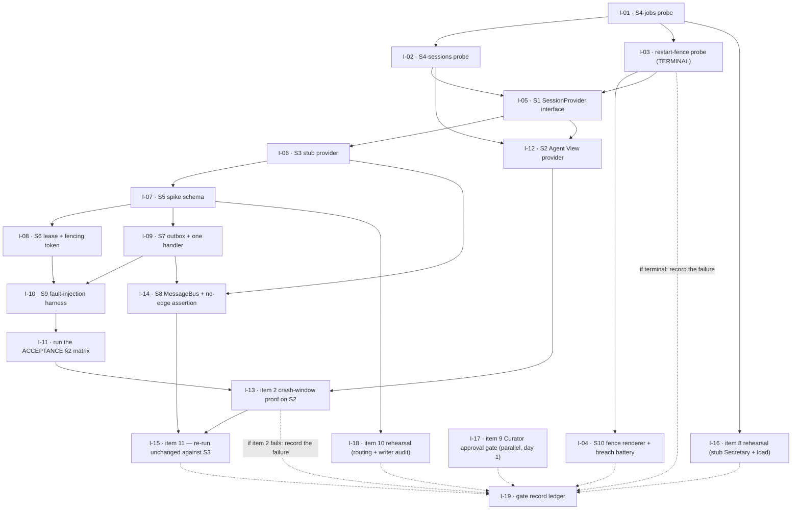

# Plan — Agent View spike, decomposed into issues

**Status:** proposal for the operator. This file *defines* issues; it does not create them. No
`gh issue create` is run from here — the desk creates them.
**Date:** 2026-08-18
**Task:** `interlock-spike-issue-decomposition-20260818`
**Refs:** `#740`; `DECISIONS.md` D-0020…D-0026; `docs/proposals/agent-view-gate-scaffold.md` §3
(scaffold inventory S1–S10, per-item minimum scaffold, phase order 0–10); `ACCEPTANCE.md` §1 and §2;
`investigation/u1-session-id-bg-experiment.md` (phase 0, answered **negative**).

---

## 1. What this decomposes, and what it deliberately leaves out

D-0020 adopts **Strategy B+**: the minimum vertical slice S1–S9 (S10 carried from
`settings/generator.py`), with one rule from Strategy C — **S1 is written first, and S3 is
implemented before S2**. §3.5 of the proposal fixes the phase order 0–10 and gives each phase an
exit condition. This file turns phases **1a–10** into 19 issues, each sized to one worker dispatch.

**Not issued here, and why:**

| Left out | Reason |
|---|---|
| **Phase 0** — the U1 `--session-id` / `--bg` experiment | Already done and recorded in `investigation/u1-session-id-bg-experiment.md`. Verdict: **negative**. |
| **The pre-spawn fence search** (Decision 6a's tail, F6) | Running in parallel as `interlock-fence-search-20260818`. Its verdict is an *input* to I-12/I-13 below, not an issue to be filed alongside them. |
| **Real proof of gate items 8 and 10** | D-0022 defers them by name to their own discharge points — item 8 *before the canary starts*, item 10 *at the canary*. The spike only **rehearses** them (I-16, I-18). The real proofs are later work and are not spike issues. |
| **The canary itself** (`ACCEPTANCE.md` §3) | Same clause. It needs v1 as a live counterparty and the implementation running. |

**Every issue below inherits D-0026.** The `SessionProvider` interface (S1) and the tests are the
**durable** output. Every implementation the spike produces — **including S5's schema** — is
throwaway by default and may be promoted only by a new `D-` entry. Each issue carries a `durable:`
field saying which side of that line it falls on, and the acceptance criteria of I-05 and I-07
require the provisional/spike marking to be *in the file itself*.

---

## 2. How to read the machine-readable block

§6 is a single fenced `yaml` block containing the whole issue set. A tool that wants the definitions
should extract that one fence and parse it; the prose sections around it are commentary and are not
required to reconstruct any issue.

Per-issue fields:

| Field | Meaning |
|---|---|
| `id` | Stable handle used by `depends_on` in this file. **Not** a GitHub number; the desk substitutes real numbers at creation time. |
| `title` | Issue title, verbatim, English. |
| `labels` | Proposed labels. See §5 for the label vocabulary — several do not exist in the repo yet and must be created first. |
| `size` | `S` = one focused worker dispatch. `M` = one dispatch, but a long one. Estimated **for an AI worker**, not for a human: mechanical breadth (many probe cases, many test rows) is cheap; genuinely novel design is not. These do not sum to D-0020's 12–16 engineer-day figure and are not meant to. |
| `phase` | The `docs/proposals/agent-view-gate-scaffold.md` §3.5 phase this issue belongs to. |
| `tier` | T1 / T2 / T3 per §3.1, or `-` where the issue is bookkeeping. |
| `gate_items` | `ACCEPTANCE.md` §1 item numbers this issue moves. `rehearses:` marks D-0022's two deferred items. |
| `scaffold` | S1–S10 components built or carried. |
| `depends_on` | Hard prerequisites, by `id`. |
| `completes_after` | I-19 only. Issues whose evidence the gate record gathers, which are **not** prerequisites for starting it — see I-19's Dependencies section for why that distinction matters. |
| `also_written_when` | I-19 only. The failure branches on which the record is written **instead of**, not after, the success-branch evidence. |
| `c2` | `survives` / `rewritten` / `moot`. See §4. |
| `durable` | A **list**, because most issues produce more than one kind of artifact. `contract` = a durable non-code artifact (S1; the gate record). `tests` = durable test material, which D-0014's rescue list and D-0026 both want kept. `throwaway` = an implementation. An issue that builds something *and* tests it carries **both** `tests` and `throwaway`, deliberately: D-0026 makes every implementation throwaway **by default**, including S5's schema, and the two halves must be promotable separately so that keeping the tests never drags the implementation along with them. |
| `body` | The issue body, verbatim, ready to post. |

---

## 3. Dependency order

Phase 0 is done. **I-03 is a terminal gate**: per D-0023 part 3 and §3.5 phase 2a, if no handle
mediates supervisor-initiated restarts, item 3 fails on Agent View and the sequence routes to
`Q-0004` rather than continuing. Everything downstream of it is conditional in the sense that the
*Agent View* verdict may end the sequence — but see §4, because most of the downstream work is not
conditional on the *provider* at all.



**Three things the graph is saying that are easy to miss.**

1. **I-17 has no edges in.** Item 9 has zero session-backend dependency (§3.1, and `ACCEPTANCE.md`
   §4 deliberately omits it from the re-run list). It can start on day 1 in parallel with I-01 and is
   unaffected by any Agent View verdict.
2. **I-04 hangs off the terminal gate but is not wasted by it.** D-0023 part 2 makes fail-closed
   *Interlock's own* obligation under D-0017 "regardless of provider". Only its restart-preservation
   half is Agent-View-shaped.
3. **The dotted edges into I-19 are not prerequisites.** The gate record is due whether the sequence
   discharges the gate or terminates at I-03 or I-13, so it must not be blocked behind evidence that a
   terminal failure guarantees will never arrive.
4. **The durable-core chain I-05 → I-07 → I-09 → I-11 does not test the provider.** It is drawn under
   I-03 to keep the §3.5 sequence honest, not because a C2 switch would invalidate it.

---

## 4. What survives a C2 switch

The parallel fence search may come up empty. If it does, D-0024's tail applies: **gate item 2 fails
on Agent View**, `Q-0004` opens, and per D-0025 the designated second spike is **C2 — Interlock-supervised
`claude -p` subprocesses**. This is the split the operator should have in hand *before* the fence
search reports, because it decides how much of the issue set is at risk.

| Verdict | Issues |
|---|---|
| **Survives unchanged** — no Agent View dependency at all | I-05 (S1), I-06 (S3), I-07 (S5), I-08 (S6), I-09 (S7), I-10 (S9), I-11 (§2 matrix), I-14 (S8), I-15 (item 11), I-16 (item 8 rehearsal), I-17 (item 9), I-18 (item 10 rehearsal), I-19 (ledger) |
| **Survives with its provider half re-pointed** | I-04 (S10) — the renderer, the `PreToolUse` deny hook and the spawn precondition are Interlock's under D-0017; only "restart preserves the fence" is re-observed against C2 |
| **Rewritten against C2** — same question, new surface | I-01 (S4-jobs), I-02 (S4-sessions), I-12 (S2 → a C2 provider), I-13 (item 2 proof) |
| **Moot under C2** | I-03 — under C2 no other party can restart a worker (D-0025), so the supervisor-restart hole D-0023 part 3 opens does not exist and the terminal probe has nothing to probe |

**13 of 19 issues are untouched by the verdict, and a fourteenth (I-04) keeps everything but its
provider-facing assertion.** That is the concrete content of D-0019's promise
that a gate failure replaces only the `SessionProvider`, and it is why the durable core is worth
starting even while the fence search is outstanding.

Two cautions on reading this table:

- **`ACCEPTANCE.md` §4 requires items 1, 2, 3, 7, 8 and 10 to be re-run in full against a new
  provider.** "Survives" above means *the issue's deliverable* survives, not that the gate evidence
  it produced carries over. I-16 and I-18's rehearsals would be re-run; their harnesses would not be
  rewritten.
- I-12 and I-13 should be created but held, not started, until the fence search reports. Starting
  I-12 first would spend a worker on a provider that item 2 may already have failed.

---

## 5. Label vocabulary

Proposed, and mostly new — the repo has no issue labels for this work yet. The desk should create
the set before filing, or strip the `labels` field and file untagged.

| Label | Meaning |
|---|---|
| `spike/agent-view` | Belongs to the D-0020 Strategy B+ spike. On every issue here. |
| `phase/1a` … `phase/10` | §3.5 phase. |
| `tier/T1`, `tier/T2`, `tier/T3` | §3.1 classification. |
| `gate-item/1` … `gate-item/11` | `ACCEPTANCE.md` §1 item the issue moves. |
| `scaffold/S1` … `scaffold/S10` | §3.2 component. |
| `size/S`, `size/M` | One worker dispatch; `M` is the long kind. |
| `durable/contract`, `durable/tests`, `durable/throwaway` | D-0026 lifetime. |
| `survives/c2`, `agent-view-specific` | §4 split. |
| `terminal-gate` | Failing this issue ends the sequence and routes to `Q-0004`. Only I-03. |
| `blocked/fence-search` | Held pending `interlock-fence-search-20260818`. Only I-12, I-13. |
| `parallel/day-1` | No prerequisites; start immediately. Only I-17. |

---

## 6. Issue definitions

```yaml
# Agent View spike (D-0020 Strategy B+) — issue definitions.
# `id` is a handle local to this file; GitHub numbers are assigned at creation.
# Phase 0 is complete (investigation/u1-session-id-bg-experiment.md) and is not an issue.
issues:

  - id: I-01
    title: "S4-jobs: probe the Agent View supervisor surface with `--exec` jobs"
    labels: [spike/agent-view, phase/1a, tier/T1, gate-item/1, gate-item/3, gate-item/8, scaffold/S4, size/M, durable/throwaway, agent-view-specific]
    size: M
    phase: "1a"
    tier: T1
    gate_items: [1, 3, 8]
    scaffold: [S4]
    depends_on: []
    c2: rewritten
    durable: [throwaway]
    body: |
      ## Background

      Phase 1a of the Agent View spike (`docs/proposals/agent-view-gate-scaffold.md` §3.5). S4 is
      split in two halves per F4: this issue is the **jobs** half, which drives supervisor-facing
      behaviour with `claude --bg --exec` jobs at zero model cost. The **sessions** half (I-02) needs
      real model-backed sessions and is separate precisely so that this half can be run freely.

      Four Appendix A unknowns are answered here because they are cheap with jobs and expensive
      without: U2, U4, U6, and the readout-latency input gate item 8 needs.

      ## Scope

      In scope — a throwaway harness that, using **only documented public commands**:

      - starts a job, reads its structured state, stops it, removes it;
      - enumerates the roster (`claude agents --json`) and asserts the output is machine-parseable
        from published output rather than scraped from rendered screen text;
      - restarts after an unexpected worker exit, and observes what the supervisor does under an
        **ungraceful daemon kill** (U4);
      - measures status-readout latency under N concurrent jobs, and records whether the daemon's
        control interface serialises status queries behind busy workers (U6) — this is gate item 8's
        provider-side input;
      - runs the **capability/version probe** (V22 `capabilities`, else `--version`) and records its
        raw output, per D-0010;
      - probes for a handle that mediates supervisor-initiated restarts — the input I-03 needs.

      Out of scope — anything requiring a conversation (that is I-02); any Interlock control-plane
      code; any durable storage.

      ## Acceptance criteria

      - [ ] Start / structured-state read / stop / removal all complete using documented public
            commands only, with output and exit codes recorded verbatim.
      - [ ] **The internals-free negative is proven**: the harness behaves identically with
            `~/.claude/jobs`, internal sockets and transcript paths made unreadable or absent. A
            harness that merely *does not currently* read them does not satisfy this — the negative
            must be executed.
      - [ ] U2, U4 and U6 are answered either way and recorded, including the negative answers.
      - [ ] Baseline and under-load readout latency are recorded as numbers with the job count.
      - [ ] The exact CLI version and the full capability-probe output are recorded (D-0010).
      - [ ] Findings land in `investigation/` in the style of `u1-session-id-bg-experiment.md`:
            transcript verbatim, verdict separated from proposal, no `D-` entry created.

      ## Gate mapping

      Supplies the provider-side inputs for **items 1, 3 and 8**. Discharges none of them on its own:
      item 1 also needs I-02's resume evidence, item 3 needs I-03 and I-04, item 8 needs I-16.

      ## Exit condition (§3.5 phase 1a)

      The supervisor verbs work through documented commands, and U2 / U4 / U6 are answered. A phase
      that fails its exit condition is **a report to a human, not a reason to proceed**.

      ## Dependencies

      None. Phase 0 is already answered (`investigation/u1-session-id-bg-experiment.md`).

      ## Notes

      Throwaway by construction (D-0026). Under a `Q-0004` switch to C2 this issue is **rewritten**
      against `claude -p` subprocesses — the questions survive, the harness does not.

  - id: I-02
    title: "S4-sessions: probe conversation resume and the worktree lifecycle on real `--bg` sessions"
    labels: [spike/agent-view, phase/1b, tier/T1, gate-item/1, gate-item/7, scaffold/S4, size/M, durable/throwaway, agent-view-specific]
    size: M
    phase: "1b"
    tier: T1
    gate_items: [1, 7]
    scaffold: [S4]
    depends_on: [I-01]
    c2: rewritten
    durable: [throwaway]
    body: |
      ## Background

      Phase 1b. The same harness as I-01, driven by a **small number of model-backed `--bg`
      sessions**. F4 is explicit that a job cannot stand in for this: a job has no conversation, so
      resume cannot be tested with one, and the worktree lifecycle only exists around real sessions.

      Item 7 is the item that must be settled by observation rather than documentation. V11/V12 say
      `claude rm` is non-destructive for uncommitted changes and both paths refuse on unpushed
      commits — but agent view's own delete is documented **destructive** for uncommitted changes,
      `claude rm --help` contradicts the doc (F5), and **untracked files are documented nowhere**
      (U5).

      ## Scope

      In scope:

      - conversation resume of a background session via `claude respawn` (V6 — *not* `--resume`,
        which reopens local history, and *not* `claude attach`, which needs a terminal and is
        therefore not a control-plane verb);
      - a git fixture carrying **uncommitted**, **untracked** (U5) and **unpushed** changes, driven
        through *every* provider-driven lifecycle transition the public CLI exposes — stop, resume,
        session end, cleanup/reclaim — across **both** agent-view delete and `claude rm` (F5);
      - whether `WorktreeRemove` (V12) can actually **veto** a transition, this being the only
        evidenced veto handle.

      Out of scope — supervisor-facing behaviour (I-01), the restart fence (I-03).

      ## Acceptance criteria

      - [ ] **The whole of item 1 is driven on one real top-level worker**: start → structured-state
            read → stop → resume, using documented public commands only. I-01 proves this shape on
            `--exec` **jobs**, and a job is not a top-level worker — per F4 it has no conversation, so
            it cannot stand in for the cycle item 1 actually names. Do not treat I-01's pass as
            covering this.
      - [ ] The structured state read here is machine-parseable from published output, not scraped
            from rendered screen text.
      - [ ] **The internals-free negative is re-run on this half too**: with `~/.claude/jobs`,
            internal sockets and transcript paths made unreadable, the session-driven cycle behaves
            identically. I-01's negative covers the jobs path only.
      - [ ] Resume preserves the conversation, demonstrated on a real `--bg` session and recorded.
      - [ ] For every transition × every fixture state: working-tree content is **byte-identical**
            afterwards, **or** the transition is refused while unsaved work exists. Byte-identical
            means a recorded hash comparison, not an eyeballed `git status`.
      - [ ] The untracked-file case (U5) is answered explicitly, since no documentation covers it.
      - [ ] The F5 contradiction between `claude rm --help` and the docs is resolved by observation
            and recorded as observed behaviour.
      - [ ] `WorktreeRemove`'s veto capability is answered either way.
      - [ ] Model-backed session count and quota consumed are recorded, and every session started is
            stopped and removed afterwards.
      - [ ] Findings land in `investigation/`.

      ## Gate mapping

      **Discharges item 1** — this half carries the full cycle on a real worker (see the first three
      criteria); I-01 supplies the supervisor-side evidence around it. Discharges **item 7** on its own, subject to the
      §3.5 exit condition. Note `ACCEPTANCE.md` §1 item 7's own tail: *if the provider can reclaim a
      worktree without an interlock the control plane can observe or veto, that is a gate failure,
      not a workaround*.

      ## Dependencies

      I-01 (the harness this extends).

      ## Notes

      Costs real subscription quota — keep the session count small and say what it was. Rewritten
      under a C2 switch.

  - id: I-03
    title: "Probe the supervisor-initiated restart fence (terminal gate for item 3)"
    labels: [spike/agent-view, phase/2a, tier/T1, gate-item/3, scaffold/S4, size/S, durable/throwaway, agent-view-specific, terminal-gate]
    size: S
    phase: "2a"
    tier: T1
    gate_items: [3]
    scaffold: [S4]
    depends_on: [I-01]
    c2: moot
    durable: [throwaway]
    body: |
      ## Background

      Phase 2a, and **the single terminal exit condition in the whole sequence** (D-0023 part 3,
      §3.5). The hole it probes: the provider's own supervisor can restart a worker with **no
      Interlock spawn call at all** (V8), and in the missing/corrupt configuration cases the
      `PreToolUse` backstop may itself be part of what is missing. Treating this as covered by the
      harness's documented persistence was explicitly rejected — that guarantee covers the happy
      path and says nothing about the degraded one item 3 names.

      ## Scope

      1. Establish a worker; delete or corrupt its per-role configuration; force the **supervisor**
         to restart it by killing the worker process out of band (V8) — **not** by asking Interlock
         to respawn it. Observe whether anything refuses the restart.
      2. Probe for a **public effective-configuration readback** (Decision 4a′). If one exists, item
         3's equality check becomes runnable as written and I-04's breach battery can be reduced.
      3. Probe CLI-surface `PreToolUse` ordering under `bypassPermissions` (U15).

      ## Acceptance criteria

      - [ ] The out-of-band kill genuinely triggers a **supervisor**-initiated restart — evidenced,
            not assumed. A test that accidentally exercises the Interlock-initiated path proves
            nothing.
      - [ ] Whether a handle mediates that restart is answered **either way**, with the commands and
            output recorded verbatim.
      - [ ] The effective-configuration readback question is answered either way (this decides
            whether D-0023's weakening of item 3 is needed at all).
      - [ ] U15 is answered.
      - [ ] The report states plainly which of the two branches below was reached.

      ## Exit condition — terminal

      > **A handle that mediates supervisor-initiated restarts exists, or item 3 fails on this
      > provider and the sequence stops here and routes to `Q-0004`.**

      Phase 2b (I-04) does not begin until this is answered. If the answer is *no handle*, the
      correct outcome is a report to a human recommending the D-0025 C2 path — **not** a workaround,
      and not a reclassification of item 3.

      ## Dependencies

      I-01 (which already probes for the handle as part of its sweep; this issue is the deliberate,
      adversarial version of that probe).

      ## Notes

      **Moot under C2.** D-0025 records that C2 removes this hole entirely, because under C2 no other
      party can restart a worker and the fail-closed spawn precondition therefore covers every start.
      If the gate routes to `Q-0004`, this issue is closed rather than rewritten.

  - id: I-04
    title: "S10: carry the per-role fencing renderer, add the `PreToolUse` deny hook and the breach-probe battery"
    labels: [spike/agent-view, phase/2b, tier/T1, gate-item/3, scaffold/S10, size/M, durable/tests, durable/throwaway, survives/c2]
    size: M
    phase: "2b"
    tier: T1
    gate_items: [3]
    scaffold: [S10]
    depends_on: [I-03]
    c2: survives
    durable: [tests, throwaway]
    body: |
      ## Background

      Phase 2b. D-0023 settles item 3 in three parts, and this issue builds parts 1 and 2: the
      **observable** (a behavioural breach-probe battery, since there is no public readback of
      effective configuration — U3) and **Interlock's own fail-closed obligation**.

      D-0023 is emphatic that the breach battery is *a deliberate weakening of item 3, accepted by a
      human, not an equivalent method*. The residual must be stated in the gate record, not hidden:
      diffing Interlock's rendered inputs proves what we wrote, not what the provider loaded.

      ## Scope

      - Carry the per-role fencing renderer from `settings/generator.py`, **minus the discarded
        transport and pattern axes** (R5).
      - Install a `PreToolUse` deny hook in session.
      - Build the **breach-probe battery**: one forbidden operation **per rule in the role's fence**,
        not one per role. This distinction is the whole point — per-role probing leaves most rules
        unobserved.
      - Implement **Interlock's own spawn precondition**: validate the rendered per-role
        configuration and **refuse to spawn** on a broken one, recording the refusal.
      - Diff Interlock's own rendered inputs across restart.

      ## Acceptance criteria

      - [ ] An Interlock-initiated restart preserves the fence, shown by the breach battery denying
            every rule after restart as it did before.
      - [ ] Every rule in every role's fence has a probe, and each probe is **denied**. Coverage is
            asserted mechanically against the rendered fence — a hand-maintained probe list that
            silently drifts from the fence is a failure of this criterion.
      - [ ] A deliberately broken configuration (config deleted, hook path unresolvable, sandbox
            profile absent) causes a **refused** spawn — never a downgraded one — and the refusal is
            recorded durably.
      - [ ] Fail-open is tested for explicitly. F2/V15/V16 record this codebase's habit of
            ignore-and-continue under bad input, and `investigation/u1-session-id-bg-experiment.md`
            §5.2 shows the same shape on the CLI: **exit 0 is not evidence of anything**.
      - [ ] The gate record entry states the residual weakening in D-0023's own terms.

      ## Gate mapping

      Discharges **item 3**, conditional on I-03 having found a handle for the supervisor-restart
      path. If I-03 came back empty, item 3 fails regardless of how good this battery is.

      ## Dependencies

      I-03 (terminal gate). If I-03 found a public effective-configuration readback, run item 3's
      equality check as written and treat the battery as complementary rather than substitutive.

      ## Notes

      **Survives C2.** D-0023 part 2 states the fail-closed obligation is Interlock's under D-0017
      "regardless of provider, so this work is not wasted under any `Q-0004` outcome". Only the
      restart-preservation assertion is re-observed against the new provider.

  - id: I-05
    title: "S1: write the provisional `SessionProvider` interface"
    labels: [spike/agent-view, phase/3, tier/T2, gate-item/11, scaffold/S1, size/M, durable/contract, survives/c2]
    size: M
    phase: "3"
    tier: T2
    gate_items: [11]
    scaffold: [S1]
    depends_on: [I-02, I-03]
    c2: survives
    durable: [contract]
    body: |
      ## Background

      Phase 3, and the **first durable artifact of the spike** (D-0026). Strategy B+ exists because
      of this ordering: S1 is written first, so no Agent-View-shaped assumption enters the contract,
      but *after* the T1 probes, because "S1 designed before any provider exists is a contract
      designed from imagination" (D-0020).

      D-0021 fixes what S1 is: **spike scaffold, not a settled contract**, marked provisional **in
      the file itself**, promoted only by a later `D-` entry. Until it exists, item 11 has nothing to
      substitute against (§2 of the proposal).

      ## Scope

      S1 carries:

      - the five D-0009 verbs (start, list, obtain structured state of, stop, resume);
      - a **provider-neutral lifecycle/availability readout** — the backend's own states plus an
        explicit **"could not observe"** case;
      - a typed error/unavailable result that is **never an empty one** (R4);
      - a **capability/version probe with a fail-closed spawn precondition** (D-0010).

      Two prohibitions, both load-bearing:

      - **S1 must not map its states onto D-0005's fact-state set.** Those six values are watcher
        facts whose predicates and precedence `Q-0012` leaves open; folding a provider's
        `blocked`/`done`/`failed` into them inside a provisional interface would either lose
        information or answer `Q-0012` by implementation. Conversion belongs to the detector layer.
      - **S1 must not carry a message-delivery verb.** Delivery stays with `MessageBus` per D-0009
        and is built as S8. What S1 records for it is the **absence** of the verb — that absence is
        the property gate items 6 and 11 exist to check.

      Also in scope: a written record of where each of the three previously-unassigned capabilities
      landed — message delivery to a worker (→ `MessageBus`/S8), reading back effective permission /
      sandbox / hook configuration (→ per I-03's finding; where it belongs to neither contract, that
      must be **written down as such**), and observing or vetoing a workspace lifecycle transition
      (→ S1, being genuinely the provider's).

      ## Acceptance criteria

      - [ ] The file states, in itself, that it is provisional and that promotion requires a `D-`
            entry (D-0021).
      - [ ] Five verbs, the neutral readout with its "could not observe" case, the typed
            error/unavailable result, and the capability probe are all present with docstrings.
      - [ ] No fact-state vocabulary appears anywhere in S1 — assert this mechanically if practical.
      - [ ] No delivery verb, and the absence is documented as deliberate with its reason.
      - [ ] Each of the three capabilities above has a **named owner** written down, including the
            "belongs to neither contract" case where that is the answer.
      - [ ] The typed result can never be constructed as an empty success (R4).

      ## Gate mapping

      Unblocks **item 11**, which §3.3 records as "blocked on S1 existing at all".

      ## Dependencies

      I-02 (the provider evidence that teaches the contract) and I-03 (the terminal gate).

      **Operator note:** S1 is provider-neutral by construction and `survives/c2`. If schedule
      pressure argues for starting it before I-03 reports, that is defensible — but it means writing
      the contract with one provider's evidence and no verdict, which is the risk D-0020 named.

      ## Notes

      **Durable output** under D-0026, together with the tests. This is the artifact the whole
      strategy is built to produce.

  - id: I-06
    title: "S3: implement the stub `SessionProvider` over local child processes"
    labels: [spike/agent-view, phase/3, tier/T2, gate-item/11, scaffold/S3, size/S, durable/throwaway, survives/c2]
    size: S
    phase: "3"
    tier: T2
    gate_items: [11]
    scaffold: [S3]
    depends_on: [I-05]
    c2: survives
    durable: [throwaway]
    body: |
      ## Background

      Phase 3. **S3 before S2** is the one rule Strategy B+ takes from Strategy C (D-0020). The
      reason is structural, not stylistic: writing the stub first means no Agent-View-shaped
      assumption ever enters the control-plane suite, so item 11 measures a structural property
      rather than a retrofit. It costs roughly 1–2 days over plain B, and **item 11 mandates S3
      regardless**.

      ## Scope

      A deliberately trivial S1 implementation over **local child processes, with no Claude in the
      loop**. ~150 LOC. Gate item 11 names this artifact by example ("a local process-based stub").

      ## Acceptance criteria

      - [ ] Implements every S1 verb, including the capability probe and the "could not observe"
            readout case — the degraded paths are the ones item 11's re-run will exercise.
      - [ ] Runs with no Claude CLI installed and no network.
      - [ ] Passes an (initially empty) control-plane suite, per the §3.5 phase 3 exit condition.
      - [ ] Deliberately trivial: no cleverness that would let a control-plane test pass against S3
            for a reason S2 would not share.

      ## Gate mapping

      Half of **item 11**; the other half is I-15's unchanged re-run.

      ## Dependencies

      I-05.

      ## Notes

      Throwaway implementation under D-0026, but **survives a C2 switch untouched** — it is exactly
      the artifact that makes the switch cheap.

  - id: I-07
    title: "S5: the spike SQLite schema slice, marked as a spike schema"
    labels: [spike/agent-view, phase/3, tier/T2, gate-item/2, gate-item/4, scaffold/S5, size/M, durable/throwaway, survives/c2]
    size: M
    phase: "3"
    tier: T2
    gate_items: [2, 4]
    scaffold: [S5]
    depends_on: [I-06]
    c2: survives
    durable: [throwaway]
    body: |
      ## Background

      Phase 3. Six tables — `run`, `session`, `lease`, `outbox`, `incident`, `action` — the minimum
      for items 2, 4, 5 and 6. **Not** the full `Q-0001` DDL.

      This is the artifact D-0026 was written about. Strategy B+'s one serious weakness is that a
      spike schema becomes *the* schema by inertia and `Q-0001` gets answered by accident instead of
      by decision. The mitigation is not vigilance; it is the marking below plus the promotion rule.

      ## Scope

      The six tables, their columns and the queries the downstream issues need. Incident rows carry
      **`dedup key` and `retry count` as required fields** (D-0007). Nothing beyond what items 2, 4,
      5 and 6 exercise.

      ## Acceptance criteria

      - [ ] **The file itself** carries an explicit note that this is a spike schema and that **no
            migration path is promised from it** (D-0026). Not a commit message, not a comment in a
            plan document — the schema file.
      - [ ] State is reconstructable by query from SQLite alone — no derived state that lives only in
            a process (D-0001).
      - [ ] `dedup key` and `retry count` are present and non-nullable on incidents (D-0007).
      - [ ] Nothing in the schema encodes a `Q-0001` answer (per-item writer assignment) or a
            `Q-0002` answer (incident collapse semantics). Where a downstream test needs one, it
            **parameterises** it rather than hard-coding it — `ACCEPTANCE.md` §2 requires this
            explicitly for both.
      - [ ] Corrupt-state behaviour is refusal, not recovery-as-empty (R3 rules that out outright).

      ## Gate mapping

      Prerequisite for **items 2 and 4**; feeds 5 and 6 through S6/S7.

      ## Dependencies

      I-06.

      ## Notes

      Throwaway **by default and by name** (D-0026). Promotion into the real implementation requires
      a new `D-` entry that says so. Survives a C2 switch: nothing in it is provider-shaped.

  - id: I-08
    title: "S6: lease with a fencing token validated atomically as part of each protected write"
    labels: [spike/agent-view, phase/4, tier/T2, gate-item/5, scaffold/S6, size/M, durable/tests, durable/throwaway, survives/c2]
    size: M
    phase: "4"
    tier: T2
    gate_items: [4, 5]
    scaffold: [S6]
    depends_on: [I-07]
    c2: survives
    durable: [tests, throwaway]
    body: |
      ## Background

      Phase 4. `ACCEPTANCE.md` §2 states the requirement and names the wrong answer in the same
      breath: **check-then-write is insufficient**, because the lease can expire between the check
      and the write. Every protected write must carry a fencing token (lease epoch) **validated
      atomically as part of the write**.

      D-0024's tail makes this issue matter more than it looks: even if a provider hands us a stable
      session identity, that closes only the *binding* half of O6. **The single-writer half comes
      from Interlock's own fencing token under every provider**, including the C2 fallback, and must
      be tested rather than assumed.

      ## Scope

      Lease acquisition, expiry, renewal and release; the fencing token; atomic validation on the
      write path; recorded refusal of stale-token writes.

      ## Acceptance criteria

      - [ ] A protected write carrying a stale token is **refused**, and the refusal is **recorded**
            — not silently dropped.
      - [ ] Validation is atomic with the write in a single transaction. A test demonstrates that the
            check-then-write shape would have admitted a writer that the atomic shape refuses.
      - [ ] At most one live holder per leased resource at any instant, shown over a timeline of
            lease rows rather than at sampled points.
      - [ ] Clock skew forward **and** backward across the expiry boundary is handled and tested.
      - [ ] Where an external destination can enforce a stale token, it does — and where it cannot,
            that is written down rather than assumed away.

      ## Gate mapping

      Prerequisite for **items 4 and 5**; the injection cases themselves are I-11.

      ## Dependencies

      I-07.

      ## Notes

      Survives C2 unchanged — this is Interlock's own obligation regardless of provider (D-0024).

  - id: I-09
    title: "S7: outbox with resend, ack, dedup and one handler that names its exactly-once mechanism"
    labels: [spike/agent-view, phase/4, tier/T2, gate-item/5, scaffold/S7, size/M, durable/tests, durable/throwaway, survives/c2]
    size: M
    phase: "4"
    tier: T2
    gate_items: [4, 5]
    scaffold: [S7]
    depends_on: [I-07]
    c2: survives
    durable: [tests, throwaway]
    body: |
      ## Background

      Phase 4. The outbox, plus **one** action handler — and the handler's job is as much
      declarative as functional: `ACCEPTANCE.md` §2 requires each handler to **name** which of two
      exactly-once mechanisms it uses, because SQLite alone cannot distinguish "the side effect
      completed" from "the side effect never started".

      ## Scope

      - Outbox rows with resend, ack, dedup key and a **durable** retry count that survives restart.
      - One action handler that **declares** its mechanism: either (1) a destination-supported
        idempotency key, or (2) transactional commit of effect and record together.
      - Where neither is achievable for a given action, the gap is explicit and the action requires a
        **human gate** (D-0004) rather than automatic recovery. If the chosen handler turns out to be
        such a case, say so and pick a different one — do not paper over it.

      ## Acceptance criteria

      - [ ] The handler names its mechanism in code, and the name is asserted by a test (so a later
            handler cannot be added without one).
      - [ ] Ack is idempotent: a lost ack causes a resend, never a lost message; a duplicate or late
            ack changes nothing; the recipient's effect count stays one.
      - [ ] Retry count is monotonic **across a process restart**.
      - [ ] No outbox row can remain in a state with no owner after recovery.
      - [ ] Duplicate delivery causes **exactly one** effect, evidenced by one effect record per
            dedup key.
      - [ ] For the external-effect path, the evidence is the **destination's own** idempotency
            record. `ACCEPTANCE.md` §2: *a case that asserts exactly-once for an external effect
            using only our own rows does not pass*.

      ## Gate mapping

      Prerequisite for **items 4 and 5**; feeds item 6 through S8.

      ## Dependencies

      I-07.

      ## Notes

      Survives C2 unchanged.

  - id: I-10
    title: "S9: fault-injection harness with deterministic kill points"
    labels: [spike/agent-view, phase/5, tier/T2, gate-item/4, gate-item/5, scaffold/S9, size/M, durable/tests, survives/c2]
    size: M
    phase: "5"
    tier: T2
    gate_items: [4, 5]
    scaffold: [S9]
    depends_on: [I-08, I-09]
    c2: survives
    durable: [tests]
    body: |
      ## Background

      Phase 5, first half. Item 5 **forbids manual one-shot demonstrations**: the gate passes only if
      every case is automated and reproducible. That makes the harness itself a gate artifact, not a
      convenience.

      D-0014's rescue list names fault injection and recovery tests as exactly the tests worth
      carrying, which is why D-0026 keeps the tests and discards the implementations.

      ## Scope

      Deterministic injection at the three points `ACCEPTANCE.md` §2 names — **before the durable
      write**, **after the write and before the side effect**, **after the side effect and before its
      result is recorded** — plus clock skew (forward and backward) and SIGSTOP. Applied to each of
      Supervisor / Dispatcher Core / Secretary separately **and in combination** (item 4).

      ## Acceptance criteria

      - [ ] Kill points are deterministic and reproducible — the same seed hits the same point, and a
            failing case can be re-run in isolation.
      - [ ] All three injection points, clock skew both directions, and SIGSTOP are supported.
      - [ ] The three components can be killed separately and in combination.
      - [ ] Nothing in the harness requires a human in the loop.
      - [ ] The harness runs in CI within a sane wall-clock budget, since I-11's matrix and I-13's
            and I-15's re-runs all sit on top of it.

      ## Gate mapping

      Prerequisite for **items 4 and 5**, and the machinery I-13 (item 2) and I-15 (item 11) re-run.

      ## Dependencies

      I-08, I-09.

      ## Notes

      **Durable** under D-0026 — this is a test artifact. Survives C2 unchanged.

  - id: I-11
    title: "Run the `ACCEPTANCE.md` §2 fault-injection matrix as an automated suite"
    labels: [spike/agent-view, phase/5, tier/T2, gate-item/4, gate-item/5, scaffold/S9, size/M, durable/tests, survives/c2]
    size: M
    phase: "5"
    tier: T2
    gate_items: [4, 5]
    scaffold: [S6, S7, S9]
    depends_on: [I-10]
    c2: survives
    durable: [tests]
    body: |
      ## Background

      Phase 5, second half — the payload the harness exists for. `ACCEPTANCE.md` §2 gives six
      targets: **Lease**, **Outbox resend**, **Ack**, **Dedup**, **Single-writer**, and
      **Observation outage**. Each row names what is injected, the invariant, and the durable
      observable that proves it.

      This is mechanically broad and conceptually narrow — a good fit for one long worker dispatch
      rather than several, because the rows share a harness and differ only in their assertions.

      ## Scope

      Every case in the §2 matrix, automated. Includes the **observation outage** row supporting
      D-0006: an observation failure is classified `OBSERVATION_UNAVAILABLE`, **never** as an
      anomaly, and `NO_ACTIVITY_EVIDENCE` is not treated as an anomaly either.

      ## Acceptance criteria

      - [ ] Every case in the §2 table is automated and reproducible. **No manual one-shots** — item
            5 rejects them by name.
      - [ ] Every assertion is against a **durable record**: a SQLite query or a persisted incident
            field. Never a screenshot, a log line read by a human, or the absence of a visible
            symptom.
      - [ ] Every **external-effect** case is additionally proven against the **destination's own**
            idempotency/effect record.
      - [ ] Mid-flight kill is covered for **each** of Supervisor / Dispatcher Core / Secretary, at
            all three injection points, and state is reconstructed by query from SQLite alone with
            work resuming from unresolved incidents and **no double execution**.
      - [ ] `Q-0002` (incident collapse semantics, re-notification window) and `Q-0001` (per-item
            writer assignment) are **parameterised, not hard-coded** — `ACCEPTANCE.md` §2 requires
            this for both, and the single-writer row asserts the property per item exercised rather
            than against a global table that does not yet exist.
      - [ ] The observation-outage row produces no termination or restart recommendation.

      ## Gate mapping

      Discharges **items 4 and 5**.

      ## Dependencies

      I-10.

      ## Notes

      **Durable** (D-0026, D-0014's rescue list). Survives C2 unchanged — and this is the suite whose
      unchanged re-run against S3 *is* item 11.

  - id: I-12
    title: "S2: implement the Agent View `SessionProvider` with a tolerant parser"
    labels: [spike/agent-view, phase/6, tier/T2, gate-item/2, scaffold/S2, size/M, durable/throwaway, agent-view-specific, blocked/fence-search]
    size: M
    phase: "6"
    tier: T2
    gate_items: [2]
    scaffold: [S2]
    depends_on: [I-05, I-02]
    c2: rewritten
    durable: [throwaway]
    body: |
      ## Background

      Phase 6. S1's second implementation, over `--bg` / `agents --json` / `stop` / `respawn`, with a
      **tolerant parser** — V26 records that there is no schema guarantee for that JSON.

      **Hold this issue until the fence search reports.** `investigation/u1-session-id-bg-experiment.md`
      answered U1 **negative**: `--session-id` is discarded under `--bg` with a warning and **exit
      0**. D-0024's tail then applies — search for another **pre-spawn** fence, and if none exists,
      item 2 fails and the `Q-0004` path opens. `interlock-fence-search-20260818` is running that
      search. Building S2 before it reports risks spending a dispatch on a provider that item 2 has
      already failed.

      ## Scope

      S1's verbs over the Agent View CLI surface, plus the tolerant parser and the
      capability/version probe wired to the fail-closed spawn precondition (D-0010).

      ## Acceptance criteria

      - [ ] Every S1 verb is implemented, including the "could not observe" readout case — which on
            this provider is reachable and must not be collapsed into an error or an empty result
            (R4).
      - [ ] The parser tolerates unknown fields and missing optional fields without crashing, and
            **fails loudly** on a shape it cannot interpret rather than returning an empty result.
      - [ ] **Exit 0 is never taken as evidence of anything.** Specifically: if any code path ever
            passes `--session-id` alongside `--bg`, it must read the identity **back from the
            roster** and reconcile, because the CLI discards the flag, warns on unstructured output
            not present in `agents --json`, and exits 0
            (`investigation/u1-session-id-bg-experiment.md` §5.2). Preferably the code path does not
            exist at all — assert that too.
      - [ ] Nothing Agent-View-shaped leaks above the S1 boundary. I-15 is the test of this, but the
            implementation should not be relying on that to catch it.
      - [ ] The CLI version S2 was written against is recorded, given V26.

      ## Gate mapping

      Prerequisite for the **item 2** proof in I-13.

      ## Dependencies

      I-05, I-02. **Blocked on** `interlock-fence-search-20260818`.

      ## Notes

      Throwaway (D-0026) and Agent-View-specific. Under a `Q-0004` switch this issue is **replaced**
      by an equivalent C2 provider issue — Interlock-supervised `claude -p` subprocesses, per
      D-0025 — against the same S1. That replacement is the cheapness D-0019 promised, and it is
      worth noting that C2's `-p` surface is where the identity ingredients U1 found actually live
      (§5.3 of the U1 note: pre-spawn UUID choice, and refusal of a second claimant).

  - id: I-13
    title: "Item 2: prove single-writer re-identification across the crash window on S2"
    labels: [spike/agent-view, phase/6, tier/T2, gate-item/2, scaffold/S2, size/M, durable/tests, agent-view-specific, blocked/fence-search]
    size: M
    phase: "6"
    tier: T2
    gate_items: [2]
    scaffold: [S1, S2, S5, S9]
    depends_on: [I-12, I-11]
    c2: rewritten
    durable: [tests]
    body: |
      ## Background

      Phase 6's exit condition, and **the riskiest item in the gate**. Item 2 moved from T1 to T2
      precisely because its crash-window proof needs a durable binding row and a supervisor to kill
      (§3.1) — a thin CLI harness cannot discharge it.

      Its precondition is unsettled at the time of writing. U1 is negative; the pre-spawn fence
      search is outstanding. Per D-0024:

      > If it fails, search for any other **pre-spawn** idempotent identity or fence; if none exists,
      > **gate item 2 fails and the `Q-0004` path opens**. Post-hoc adoption is explicitly **not** an
      > acceptable substitute for a pre-spawn fence.

      ## Scope

      Persist the session↔run binding in SQLite at spawn, on whatever pre-spawn fence the search
      returned. Kill at each injection point — before the binding is committed, between spawn and
      commit, after commit — restart, and assert re-identification.

      ## Acceptance criteria

      - [ ] Re-identification yields **exactly one** session per run at **every** injection point.
      - [ ] A second writer is **refused** rather than admitted, and the refusal is recorded.
      - [ ] Sessions are enumerated via the public CLI and **no orphan session is adopted twice**.
      - [ ] The fence used is **pre-spawn**. Attribute matching on `cwd` + `startedAt` + `name` is
            **not** a fence and does not satisfy this: `startedAt` is only knowable after the spawn,
            `name` is a display name and not an identity (V20 — and E2 shows the CLI *generates* it
            from the prompt, so it is not even caller-controlled), and a crash-then-retry can leave
            two matching workers alive before any reconciler runs.
      - [ ] **A single-writer violation at any injection point is a gate failure** and is reported as
            one. An adoption rule that picks a winner without proving the loser never wrote is a
            reclassification of item 2 wearing the clothes of a mitigation (D-0024) — do not ship one.

      ## Gate mapping

      Discharges **item 2**, or fails it. There is no third outcome.

      ## Dependencies

      I-12, I-11 (the injection harness and the matrix it runs). **Blocked on**
      `interlock-fence-search-20260818` — if that search comes up empty, **this issue is closed as
      the gate failure it is**, and the `Q-0004` / C2 path opens. It is not re-scoped.

      ## Notes

      Under C2 this issue is rewritten, not deleted: the same predicate, against the `-p` surface.
      U27 and U28 (raised by the U1 note) are the open questions it would then have to answer —
      whether the `-p` refusal is **atomic** under a genuine race rather than check-then-create, and
      whether after a SIGKILL of the holder `--resume <uuid>` still succeeds **and** a fresh claimant
      is still refused. Both halves must hold together.

  - id: I-14
    title: "S8: `MessageBus` as a worker-outbound MCP endpoint, with the static no-edge assertion"
    labels: [spike/agent-view, phase/7, tier/T2, gate-item/6, scaffold/S8, size/M, durable/tests, durable/throwaway, survives/c2]
    size: M
    phase: "7"
    tier: T2
    gate_items: [6]
    scaffold: [S8]
    depends_on: [I-09, I-06]
    c2: survives
    durable: [tests, throwaway]
    body: |
      ## Background

      Phase 7. Per F1 the transport is necessarily **worker-outbound**, which has a consequence the
      gate record must state rather than hide: item 6's "with no Agent View UI attached" condition is
      **trivially satisfiable**, because the UI is not on the delivery path at all. That makes the
      item easier than it reads. Claiming it as a strong result would be overclaiming.

      The part that is *not* trivial is the static assertion, and it is the one that pairs with item
      11.

      ## Scope

      `MessageBus` as a worker-outbound MCP endpoint, on top of S7's outbox, plus the static
      no-dependency-edge assertion.

      ## Acceptance criteria

      - [ ] With no UI attached: a task is sent, the first delivery is dropped, and the outbox
            resends with **exactly one** ack.
      - [ ] Repeated with the UI attached but its session state deliberately **stale**: delivery
            outcomes are unchanged. Delivery decisions derive from SQLite, never from UI/session
            state.
      - [ ] **Static assertion**: the `MessageBus` implementation has **no dependency edge** to the
            `SessionProvider`. Enforced in CI, so a later edge fails the build rather than being
            found at the gate.
      - [ ] The gate record states the F1 caveat plainly — the "UI not attached" condition is
            trivially satisfied because the UI is not on the delivery path.

      ## Gate mapping

      Discharges **item 6**.

      ## Dependencies

      I-09 (outbox), I-06 (a dispatched worker — the **stub** provider is the right one to use here,
      which is itself a demonstration of the no-edge property).

      ## Notes

      Survives C2 unchanged, by construction: an implementation with no edge to the
      `SessionProvider` cannot be invalidated by replacing it.

  - id: I-15
    title: "Item 11: re-run the control-plane suite unchanged against S3"
    labels: [spike/agent-view, phase/8, tier/T2, gate-item/11, scaffold/S1, scaffold/S3, size/S, durable/tests, survives/c2]
    size: S
    phase: "8"
    tier: T2
    gate_items: [11]
    scaffold: [S1, S2, S3]
    depends_on: [I-13, I-14]
    c2: survives
    durable: [tests]
    body: |
      ## Background

      Phase 8. The demonstration D-0019's whole promise rests on: *even if Agent View does not hold,
      only the `SessionProvider` need be swapped*. `ACCEPTANCE.md` item 11 insists this be
      **demonstrated rather than argued**.

      Because S3 was written **before** S2 (D-0020), this should be close to a formality — that is
      the point of the ordering, and if it is *not* a formality, the finding is valuable and belongs
      in the gate record.

      ## Scope

      Run the whole control-plane suite — SQLite SoT, fact states, incident lifecycle, `MessageBus`
      delivery/ack/dedup, role boundaries — against S3, unchanged.

      ## Acceptance criteria

      - [ ] **Zero test modifications required.** §3.5's exit condition is literal.
      - [ ] Any test that *does* require modification is recorded as a **leak** of session-backend
            detail into the control plane, and **is fixed before the gate passes** — not annotated,
            not skipped, not marked expected-fail.
      - [ ] The suite is run against S3 in CI from this point on, so a later leak fails the build on
            the day it is introduced.
      - [ ] The run is against the *same* suite artifact as the S2 run, evidenced (e.g. same test ids,
            differing only in provider fixture).

      ## Gate mapping

      Discharges **item 11**.

      ## Dependencies

      I-13, I-14 (the suite must be complete before "unchanged" means anything).

      ## Notes

      Survives C2 — and if the gate fails, this issue becomes the *measurement* of how cheap the
      switch actually is.

  - id: I-16
    title: "Item 8 rehearsal: stub Secretary intake with an explicit queue boundary, under load"
    labels: [spike/agent-view, phase/9, tier/T3, gate-item/8, scaffold/S4, size/M, durable/tests, durable/throwaway, survives/c2]
    size: M
    phase: "9"
    tier: T3
    gate_items: ["rehearses:8"]
    scaffold: [S4]
    depends_on: [I-01]
    c2: survives
    durable: [tests, throwaway]
    body: |
      ## Background

      Phase 9, first half. **This is a rehearsal, not a discharge.** D-0022 records item 8 as a
      scoped exception to D-0019: the real proof is *the same absence of blocking shown against the
      real Secretary under genuine worker load*, and it is due **before the canary starts** (D-0013)
      — a Secretary that blocks under load would invalidate the canary's own measurements.

      Every gate record entry for item 8 must be labelled **"proven on the spike slice"**, never as
      the discharge.

      ## Scope

      A stub Secretary intake with an **explicit queue boundary**, driven by a load generator of S4
      `--exec` jobs at the worker cap, plus an open incident awaiting Dispatcher AI judgement and a
      long-running task in flight.

      ## Acceptance criteria

      - [ ] **Structural**: intake and the queue boundary are asynchronous, asserted in code — no
            Secretary response path can be blocked behind worker monitoring, long-running work, or an
            AI judgement.
      - [ ] **Empirical**: baseline (idle) and under-load request→response latency are recorded and
            compared, with the worker count stated.
      - [ ] The U6 finding from I-01 — whether the daemon's control interface serialises status
            queries behind busy workers — is folded in, since a serialising control interface would
            put the blocking somewhere the structural assertion cannot see.
      - [ ] **No numeric threshold is invented.** `Q-0011` is unresolved; the gate check is the
            *absence of blocking dependencies* plus the recorded comparison (`ACCEPTANCE.md` §1 item
            8). A passing number here proves nothing on its own.
      - [ ] The output is explicitly labelled a rehearsal, naming its real discharge point.

      ## Gate mapping

      **Rehearses item 8.** Does not discharge it (D-0022).

      ## Dependencies

      I-01 (the `--exec` load generator).

      ## Notes

      Survives C2 as an artifact; per `ACCEPTANCE.md` §4 the item's *evidence* would be re-run
      against a new provider.

  - id: I-17
    title: "Item 9: Curator promotion gate with a content-digest approval record"
    labels: [spike/agent-view, phase/9, tier/T3, gate-item/9, size/M, durable/tests, durable/throwaway, survives/c2, parallel/day-1]
    size: M
    phase: "9"
    tier: T3
    gate_items: [9]
    scaffold: []
    depends_on: []
    c2: survives
    durable: [tests, throwaway]
    body: |
      ## Background

      Phase 9, second half — and the one issue in this set with **no dependency on anything**. Item 9
      tests nothing about the session backend (§3.1); its dependencies are the Curator promotion path
      and the approval record, both Interlock-internal. `ACCEPTANCE.md` §4 deliberately omits item 9
      from the list of items that must be re-run against a new provider.

      **Start it on day 1, in parallel, with whoever is free.** It is unaffected by the fence search,
      by the terminal gate at I-03, and by any `Q-0004` outcome.

      ## Scope

      A Curator stub, an approval record naming an **immutable candidate version by content digest**,
      and a path audit from Curator output to skill material.

      ## Acceptance criteria

      Promotion is **refused and the refusal recorded** in all five negative cases:

      - [ ] approval record **absent**;
      - [ ] approval **forged but unrecorded**;
      - [ ] approval **revoked**;
      - [ ] candidate **mutated after approval** (this is why the digest exists — an approval record
            merely *existing* is not sufficient);
      - [ ] a valid approval **replayed against a different candidate**.

      Plus:

      - [ ] A **path audit** shows no code path from Curator output to skill material that bypasses
            the approval gate.
      - [ ] A negative test **fails the build** if such a path is added later. Item 9 asks for the
            build failure specifically, not merely for a passing audit today.

      ## Gate mapping

      **Discharges item 9 in full** (D-0022), independently of the Agent View verdict.

      ## Dependencies

      None.

      ## Notes

      Survives C2 untouched. If the Agent View gate fails outright, this issue's result still stands.

  - id: I-18
    title: "Item 10 rehearsal: run-start routing point, run→owner ledger and writer audit"
    labels: [spike/agent-view, phase/10, tier/T3, gate-item/10, size/M, durable/tests, durable/throwaway, survives/c2]
    size: M
    phase: "10"
    tier: T3
    gate_items: ["rehearses:10"]
    scaffold: [S5]
    depends_on: [I-07]
    c2: survives
    durable: [tests, throwaway]
    body: |
      ## Background

      Phase 10. **A rehearsal against a synthetic counterparty**, and the most explicitly deferred
      item in the gate. D-0022: item 10's real proof needs v1 as a live counterparty and is
      discharged **at the canary itself**, under numeric criteria `Q-0005` has not settled.

      The property being rehearsed is the one that makes the canary cheap: **rollback is a routing
      change, not a data migration**.

      ## Scope

      A run-start routing point, a run→owning-system ledger, and a writer audit over both stores,
      against a **synthetic** counterparty standing in for v1.

      ## Acceptance criteria

      - [ ] Exactly one new run is routed to Interlock.
      - [ ] **No run changes owner mid-flight.**
      - [ ] The writer audit over both stores shows **no record written by both systems**.
      - [ ] A rehearsed rollback **changes only the routing decision** — no data migration, no
            in-flight state conversion. Assert this by showing the stores are byte-identical across
            the rollback except for routing rows.
      - [ ] **No numeric go/no-go criteria are invented** — canary duration, sample size and criteria
            are `Q-0005` and remain open (`ACCEPTANCE.md` §1 item 10).
      - [ ] The output is labelled a rehearsal against a synthetic counterparty, naming the canary as
            its discharge point.

      ## Gate mapping

      **Rehearses item 10.** Does not discharge it (D-0022).

      ## Dependencies

      I-07 (the ledger needs the schema).

      ## Notes

      Survives C2 as an artifact — the routing point has no provider dependency. Per `ACCEPTANCE.md`
      §4 the item's evidence is re-run against a new provider regardless.

  - id: I-19
    title: "Gate record: label every Agent View gate item as proven-on-spike or re-proven-later"
    labels: [spike/agent-view, size/S, durable/contract, survives/c2]
    size: S
    phase: "-"
    tier: "-"
    gate_items: [1, 2, 3, 4, 5, 6, 7, 8, 9, 10, 11]
    scaffold: []
    depends_on: []
    completes_after: [I-04, I-15, I-16, I-17, I-18]
    also_written_when: [I-03 fails, I-13 fails]
    c2: survives
    durable: [contract]
    body: |
      ## Background

      D-0022 requires that **every gate record entry is labelled either "proven on the spike slice"
      or "re-proven on the real implementation"**. Without a single place where that labelling lives,
      the scoped exception it grants — two items deferred, not waived — degrades into an
      unaccountable claim that the gate passed.

      This issue produces that record. It is bookkeeping, and it is the artifact the operator reads
      when deciding whether implementation may start.

      ## Scope

      One document covering all eleven items, each row carrying: the verdict, the evidence (issue and
      artifact), the D-0022 label, and — where applicable — the named later discharge point.

      ## Acceptance criteria

      - [ ] All eleven items are present. None omitted, none merged.
      - [ ] Items **1–7 and 11** are labelled discharged, or the specific failure is recorded as a
            failure (D-0022: items 1–7 and 11 in full; item 9 in full but independently).
      - [ ] **Item 9** is recorded as discharged in full and **independently of the spike**.
      - [ ] **Items 8 and 10** are recorded as **rehearsed, explicitly not discharged**, each naming
            its discharge point: item 8 **before the canary starts**, item 10 **at the canary**. The
            record must state that this is a **scoped exception to D-0019 limited to those two
            items**, and that any further item slipping past the gate is a new decision rather than
            an extension of this one.
      - [ ] **Item 3's residual is stated in D-0023's own terms** — the breach-probe substitution is
            a deliberate weakening accepted by a human, not an equivalent method, and diffing our own
            rendered inputs proves what we wrote rather than what the provider loaded.
      - [ ] **Item 6's F1 caveat is stated** — the "no UI attached" condition is trivially satisfied
            because the UI is not on the delivery path.
      - [ ] Every artifact is classified per **D-0026**: durable (S1, tests) or throwaway
            (everything else, **including S5's schema**), with the note that promotion requires a new
            `D-` entry.
      - [ ] If the gate failed at I-03 or I-13, the record says so and points at `Q-0004` / D-0025's
            C2 designation. **A gate record that only exists on success is not a gate record.**

      ## Dependencies

      **None — deliberately.** `completes_after` names the issues whose evidence the record gathers
      on the success branch, but they are not prerequisites for *starting* it, because the record is
      most needed exactly when they never run. If I-03's terminal probe comes back empty, I-04 never
      begins; if the fence search comes back empty, I-13 is closed as a gate failure and I-15 is
      never reached. In both branches this issue is still due, and its content is the failure and the
      route to `Q-0004` (D-0025).

      Practically: open it at the start of the spike, fill rows as evidence lands, and close it when
      the sequence ends — by discharge or by termination.

      ## Notes

      Survives C2, with different contents.
```

---

## 7. Sources

- `DECISIONS.md` — D-0019 through D-0026; `Q-0001`, `Q-0002`, `Q-0004`, `Q-0005`, `Q-0011`, `Q-0012`,
  `Q-0021`.
- `docs/proposals/agent-view-gate-scaffold.md` — §1.5 (F1–F6), §3.1 (tiers), §3.2 (S1–S10), §3.3
  (per-item minimum scaffold and pass/fail predicates), §3.4 (strategies), §3.5 (phase order and exit
  conditions), §5 (Q-0004 candidates), Appendix A (U-register).
- `ACCEPTANCE.md` — §1 (the eleven gate items and their verification methods), §2 (fault-injection
  targets), §3 (canary and rollback), §4 (re-run list for a new provider).
- `investigation/u1-session-id-bg-experiment.md` — phase 0, answered negative; U27–U30.
- `CHARTER.md` §3.4, §4, §5. The `R1`–`R6` repository facts cited above are the proposal's §1.4 rows,
  each sourced from `PORTING_LEDGER.md` — including the `carry (invariant)` classifications and
  `settings/generator.py` as S10's carry source.
